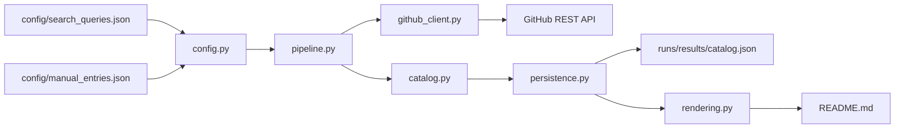
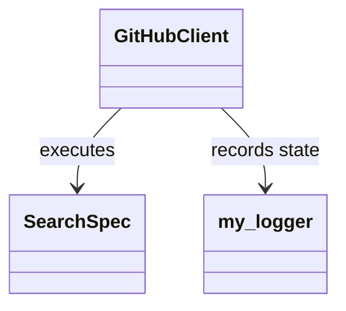

<!-- LOCKED: false -->

> **Standalone deployment repository.** This repository hosts the current Medical Component Market frontend prototype on GitHub Pages. The deployable app lives in [`web/`](./web/), the four concept meanings are documented in [`docs/concepts.md`](./docs/concepts.md), and the Pages workflow is [`deploy-pages-prototype.yml`](./.github/workflows/deploy-pages-prototype.yml). The static site is built from `main`; the historical ecosystem catalog below is retained as source context only.

# Awesome DSH Med Plugin Ecosystem

Purpose: maintain a rule-based, reviewable candidate directory spanning the DeepSeek Harness (DSH) plugin ecosystem, medical AI components, and reusable general Agent infrastructure.

Entries are grouped as Plugin, Skill, Tool, MCP Server, and CLI. Inclusion is neither a clinical endorsement nor proof of DSH compatibility.

Last catalog change: `2026-08-25T10:14:54Z` · Repositories: **190** · Minimum stars: **100**
Repository lists are collapsed by category. Expand a section for a compact comparison table followed by full vertical repository details.

## Contents

- [Catalog summary](#catalog-summary)
- [Plugin](#plugin)
- [Skill](#skill)
- [Tool](#tool)
- [MCP Server](#mcp-server)
- [CLI](#cli)
- [Automation architecture](#automation-architecture)
- [Safety and scope](#safety-and-scope)
- [Contributing](#contributing)
- [License](#license)

## Catalog summary

| Category | Repositories |
|---|---:|
| Plugin | 50 |
| Skill | 27 |
| Tool | 69 |
| MCP Server | 27 |
| CLI | 17 |

## Plugin

<details>
<summary><strong>Browse 50 repositories</strong></summary>

| Repository | Stars | License | Language | Updated |
|---|---:|---|---|---|
| [deepseek-ai/deepseek-harness](https://github.com/deepseek-ai/deepseek-harness) | 193,929 | MIT | TypeScript | 2026-08-25 |
| [nexu-io/open-design](https://github.com/nexu-io/open-design) | 91,286 | Apache-2.0 | TypeScript | 2026-08-25 |
| [wshobson/agents](https://github.com/wshobson/agents) | 39,105 | MIT | Python | 2026-08-25 |
| [awesome-dsh-plugin/awesome-dsh-plugin](https://github.com/awesome-dsh-plugin/awesome-dsh-plugin) | 12,491 | CC0-1.0 | Python | 2026-08-25 |
| [Devin-AXIS/iPolloWork](https://github.com/Devin-AXIS/iPolloWork) | 4,779 | NOASSERTION | TypeScript | 2026-08-25 |
| [liustack/modlens](https://github.com/liustack/modlens) | 3,645 | MIT | TypeScript | 2026-08-25 |
| [whiteguo233/OpenBiliClaw](https://github.com/whiteguo233/OpenBiliClaw) | 3,032 | MIT | Python | 2026-08-25 |
| [ccch1mneyyy/dsh-TUI](https://github.com/ccch1mneyyy/dsh-TUI) | 2,516 | MIT | TypeScript | 2026-08-25 |
| [dsh-market/dsh-market](https://github.com/dsh-market/dsh-market) | 2,316 | MIT | TypeScript | 2026-08-25 |
| [microsoft/azure-skills](https://github.com/microsoft/azure-skills) | 1,410 | MIT | Shell | 2026-08-24 |
| [AdamPlatin123/awesome-dsh-plugins](https://github.com/AdamPlatin123/awesome-dsh-plugins) | 1,384 | MIT | Python | 2026-08-25 |
| [dsh-tauri-desk/deepseek-harness-desktop](https://github.com/dsh-tauri-desk/deepseek-harness-desktop) | 1,147 | MIT | Rust | 2026-08-25 |
| [bowenliang123/dsh-context](https://github.com/bowenliang123/dsh-context) | 1,018 | Apache-2.0 | TypeScript | 2026-08-25 |
| [Anil-matcha/awesome-dsh-plugin](https://github.com/Anil-matcha/awesome-dsh-plugin) | 987 | NOASSERTION | NOASSERTION | 2026-08-25 |
| [NanmiCoder/dsh-agent-teams](https://github.com/NanmiCoder/dsh-agent-teams) | 982 | MIT | TypeScript | 2026-08-25 |
| [0xsline/awesome-deepseek-harness](https://github.com/0xsline/awesome-deepseek-harness) | 893 | CC0-1.0 | Python | 2026-08-25 |
| [ChatCut-Inc/agent-plugin](https://github.com/ChatCut-Inc/agent-plugin) | 819 | NOASSERTION | JavaScript | 2026-08-25 |
| [devoxx/DevoxxGenieIDEAPlugin](https://github.com/devoxx/DevoxxGenieIDEAPlugin) | 676 | MIT | Java | 2026-08-24 |
| [vibeinging/dsh-desktop](https://github.com/vibeinging/dsh-desktop) | 631 | MIT | JavaScript | 2026-08-25 |
| [Railly/tinte](https://github.com/Railly/tinte) | 614 | MIT | TypeScript | 2026-08-21 |
| [dlech/KeeAgent](https://github.com/dlech/KeeAgent) | 566 | NOASSERTION | C# | 2026-08-24 |
| [Shopify/Shopify-AI-Toolkit](https://github.com/Shopify/Shopify-AI-Toolkit) | 512 | MIT | JavaScript | 2026-08-24 |
| [WYH66666666/DSH-Transparent-UI-Plugin](https://github.com/WYH66666666/DSH-Transparent-UI-Plugin) | 384 | AGPL-3.0 | JavaScript | 2026-08-25 |
| [omdsh-dev/dsh-genui](https://github.com/omdsh-dev/dsh-genui) | 331 | MIT | TypeScript | 2026-08-25 |
| [bowang-lab/MedSAMSlicer](https://github.com/bowang-lab/MedSAMSlicer) | 299 | NOASSERTION | Python | 2026-08-20 |
| [Zhiyuan-Fan/Awesome-DeepSeek-Harness-Plugins](https://github.com/Zhiyuan-Fan/Awesome-DeepSeek-Harness-Plugins) | 298 | MIT | NOASSERTION | 2026-08-25 |
| [bruc3van/awesome-dsh-plugin](https://github.com/bruc3van/awesome-dsh-plugin) | 274 | MIT | JavaScript | 2026-08-25 |
| [V1ki/dsh-plugin-subscriptions](https://github.com/V1ki/dsh-plugin-subscriptions) | 269 | MIT | TypeScript | 2026-08-25 |
| [liustack/modsearch](https://github.com/liustack/modsearch) | 267 | MIT | TypeScript | 2026-08-25 |
| [op7418/pilot-harness](https://github.com/op7418/pilot-harness) | 255 | MIT | TypeScript | 2026-08-25 |
| [ZSeven-W/dsh-ios](https://github.com/ZSeven-W/dsh-ios) | 251 | MIT | TypeScript | 2026-08-25 |
| [mattermost/mattermost-plugin-agents](https://github.com/mattermost/mattermost-plugin-agents) | 246 | Apache-2.0 | Go | 2026-08-24 |
| [it235/office-ai-agent](https://github.com/it235/office-ai-agent) | 244 | Apache-2.0 | Visual Basic .NET | 2026-08-24 |
| [Minglink/dsh-infinite-gen-2](https://github.com/Minglink/dsh-infinite-gen-2) | 239 | MIT | PowerShell | 2026-08-25 |
| [hikariming/dshfind](https://github.com/hikariming/dshfind) | 222 | NOASSERTION | TypeScript | 2026-08-25 |
| [liangmianya/dsh-synapse](https://github.com/liangmianya/dsh-synapse) | 215 | MIT | JavaScript | 2026-08-25 |
| [libukai/awesome-deepseek-harness](https://github.com/libukai/awesome-deepseek-harness) | 206 | NOASSERTION | NOASSERTION | 2026-08-25 |
| [Humalike/hermes-humalike-plugin](https://github.com/Humalike/hermes-humalike-plugin) | 201 | MIT | Python | 2026-08-23 |
| [Dominic789654/awesome-deepseek-harness](https://github.com/Dominic789654/awesome-deepseek-harness) | 194 | NOASSERTION | TypeScript | 2026-08-25 |
| [d-dev0101/open-sea-skin](https://github.com/d-dev0101/open-sea-skin) | 190 | MIT | JavaScript | 2026-08-25 |
| [Han-1413141/dsh-cost-meter](https://github.com/Han-1413141/dsh-cost-meter) | 187 | MIT | JavaScript | 2026-08-25 |
| [imsai-sh/awesome-deepseek-harness-plugins](https://github.com/imsai-sh/awesome-deepseek-harness-plugins) | 185 | MIT | TypeScript | 2026-08-25 |
| [zenstory-ai/oh-story-dsh](https://github.com/zenstory-ai/oh-story-dsh) | 176 | MIT | Python | 2026-08-25 |
| [edbeeching/godot_rl_agents_plugin](https://github.com/edbeeching/godot_rl_agents_plugin) | 171 | MIT | GDScript | 2026-08-13 |
| [Nagi-ovo/dsh-find-plugins](https://github.com/Nagi-ovo/dsh-find-plugins) | 169 | BSD-3-Clause | JavaScript | 2026-08-24 |
| [bramwalet/Subliminal.bundle](https://github.com/bramwalet/Subliminal.bundle) | 156 | MIT | HTML | 2026-04-24 |
| [Gerstep/HumanCompiler](https://github.com/Gerstep/HumanCompiler) | 155 | NOASSERTION | TypeScript | 2026-07-26 |
| [SkyAPM/java-plugin-extensions](https://github.com/SkyAPM/java-plugin-extensions) | 140 | Apache-2.0 | Java | 2026-07-29 |
| [jenkinsci/ssh-agents-plugin](https://github.com/jenkinsci/ssh-agents-plugin) | 115 | MIT | Java | 2026-07-11 |
| [get-convex/convex-agent-plugins](https://github.com/get-convex/convex-agent-plugins) | 111 | MIT | Shell | 2026-08-24 |

### Repository details

#### 1. [deepseek-ai/deepseek-harness](https://github.com/deepseek-ai/deepseek-harness) · ⭐ 193,929

**Description:** DeepSeek Harness: Everything is a Plugin.

- **License:** `MIT`
- **Language:** `TypeScript`
- **Updated:** `2026-08-25`
- **Discovery scope:** `general`
- **Topics:** `ai-agents` · `cordis` · `dsh` · `dsh-plugin`

---

#### 2. [nexu-io/open-design](https://github.com/nexu-io/open-design) · ⭐ 91,286

**Description:** 🎨 Best DeepSeek Harness Design Plugin. The open-source Claude Design alternative. 🖥️ Local-first desktop app. 🖼️ Your coding agent becomes the design engine: prototypes, landing pages, dashboards, slides, images & video…

- **License:** `Apache-2.0`
- **Language:** `TypeScript`
- **Updated:** `2026-08-25`
- **Discovery scope:** `general`
- **Topics:** `agent-skills` · `ai-design` · `byok` · `claude-code-for-design` · `claude-design` · `codex-design` · `coding-agents` · `cursor-design`

---

#### 3. [wshobson/agents](https://github.com/wshobson/agents) · ⭐ 39,105

**Description:** Multi-harness agentic plugin marketplace for Claude Code, Codex, Cursor, OpenCode, GitHub Copilot, and Google Antigravity

- **License:** `MIT`
- **Language:** `Python`
- **Updated:** `2026-08-25`
- **Discovery scope:** `general`
- **Topics:** `agent-skills` · `agentic-ai` · `agents` · `ai-agents` · `anthropic` · `antigravity` · `claude` · `claude-code`

---

#### 4. [awesome-dsh-plugin/awesome-dsh-plugin](https://github.com/awesome-dsh-plugin/awesome-dsh-plugin) · ⭐ 12,491

**Description:** A curated list of plugins for DeepSeek Harness (dsh) · DeepSeek Harness 插件精选列表

- **License:** `CC0-1.0`
- **Language:** `Python`
- **Updated:** `2026-08-25`
- **Discovery scope:** `general`
- **Topics:** `awesome` · `awesome-list` · `deepseek-harness` · `dsh` · `dsh-plugin`

---

#### 5. [Devin-AXIS/iPolloWork](https://github.com/Devin-AXIS/iPolloWork) · ⭐ 4,779

**Description:** Enterprise-grade, local-first Agent Workbench for people and agent teams. A unified multi-engine workspace for Codex Harness, DeepSeek Harness, and OpenCode, with unified plugins and Skills, multi-agent projects and tas…

- **License:** `NOASSERTION`
- **Language:** `TypeScript`
- **Updated:** `2026-08-25`
- **Discovery scope:** `general`
- **Topics:** `agent-collaboration` · `agent-skills` · `ai-agents` · `ai-work` · `claude-code` · `codex` · `codex-plugin` · `deepseek-harness`

---

#### 6. [liustack/modlens](https://github.com/liustack/modlens) · ⭐ 3,645

**Description:** The first vision plugin for DeepSeek Harness, and the vision bridge for every text-only coding agent. Paste an image, get structured JSON evidence (OCR, layout, semantics). \| 全网最强 DeepSeek Harness 外挂视觉插件，为 DeepSeek、GLM…

- **License:** `MIT`
- **Language:** `TypeScript`
- **Updated:** `2026-08-25`
- **Discovery scope:** `general`
- **Topics:** `agent-skills` · `claude-code` · `claude-skills` · `codex` · `cordis` · `deepseek` · `dsh` · `dsh-plugin`

---

#### 7. [whiteguo233/OpenBiliClaw](https://github.com/whiteguo233/OpenBiliClaw) · ⭐ 3,032

**Description:** 本地私有、开源的自进化跨平台 AI 内容发现 Agent：先理解你，再主动从 B站、小红书、抖音、YouTube、X、知乎、Reddit、微博等平台与开放 Web 寻找内容。（支持 deepseek harness 插件） \| Local-first open-source cross-platform AI content discovery agent: understands you, then proactively fin…

- **License:** `MIT`
- **Language:** `Python`
- **Updated:** `2026-08-25`
- **Discovery scope:** `general`
- **Topics:** `ai-agent` · `bilibili` · `chrome-extension` · `content-discovery` · `cross-platform` · `deepseek-harness` · `douyin` · `dsh`

---

#### 8. [ccch1mneyyy/dsh-TUI](https://github.com/ccch1mneyyy/dsh-TUI) · ⭐ 2,516

**Description:** DSH 官方公众号收录的 TUI 补位插件：Claude Code 风，鲸鱼顶栏/实时状态/流式思考/双击 Esc 回滚/上下文进度+TPS。npm 一键装。 DSH official WeChat featured TUI plugin — Claude Code style: whale bar, live status, streaming thoughts, double-Esc rollback, context bar +…

- **License:** `MIT`
- **Language:** `TypeScript`
- **Updated:** `2026-08-25`
- **Discovery scope:** `general`
- **Topics:** `claude-code` · `coding-agent` · `deepseek` · `deepseek-harness` · `dsh-plugin` · `ink` · `react` · `terminal`

---

#### 9. [dsh-market/dsh-market](https://github.com/dsh-market/dsh-market) · ⭐ 2,316

**Description:** The plugin market inside DeepSeek Harness — browse, search, one-click install · DSH 可视化插件市场

- **License:** `MIT`
- **Language:** `TypeScript`
- **Updated:** `2026-08-25`
- **Discovery scope:** `general`
- **Topics:** `deepseek-harness` · `dsh-plugin` · `marketplace`

---

#### 10. [microsoft/azure-skills](https://github.com/microsoft/azure-skills) · ⭐ 1,410

**Description:** Official agent plugin providing skills and MCP server configurations for Azure scenarios.

- **License:** `MIT`
- **Language:** `Shell`
- **Updated:** `2026-08-24`
- **Discovery scope:** `general`
- **Topics:** `agent-skills`

---

#### 11. [AdamPlatin123/awesome-dsh-plugins](https://github.com/AdamPlatin123/awesome-dsh-plugins) · ⭐ 1,384

**Description:** DSH 插件雷达与精选榜：多路自动发现 9000+ 候选，容器真实安装路径运行级实测（四档判定），精选 Top 50 · 11 类人工策展，全量索引 PLUGINS-ALL.md，自动更新。

- **License:** `MIT`
- **Language:** `Python`
- **Updated:** `2026-08-25`
- **Discovery scope:** `general`
- **Topics:** `agent-plugins` · `awesome-list` · `deepseek-harness` · `dsh` · `dsh-plugin` · `plugin-registry`

---

#### 12. [dsh-tauri-desk/deepseek-harness-desktop](https://github.com/dsh-tauri-desk/deepseek-harness-desktop) · ⭐ 1,147

**Description:** DeepSeek Harness Tauri 桌面版 \| Only 5mb installer, zero environment setup, preset plugins, Windows / macOS / Linux.

- **License:** `MIT`
- **Language:** `Rust`
- **Updated:** `2026-08-25`
- **Discovery scope:** `general`
- **Topics:** `deepseek` · `deepseek-harness` · `desktop` · `dsh` · `dsh-desktop` · `dsh-plugin` · `tauri`

---

#### 13. [bowenliang123/dsh-context](https://github.com/bowenliang123/dsh-context) · ⭐ 1,018

**Description:** The best DeepSeek Harness plugin for context insight and management, with context dashboard / browser and context command, for context statistics, composition, breakdown, evolution details, understanding how the context…

- **License:** `Apache-2.0`
- **Language:** `TypeScript`
- **Updated:** `2026-08-25`
- **Discovery scope:** `general`
- **Topics:** `cordis-plugin` · `deepseek-harness` · `deepseek-harness-plugin` · `dsh-external` · `dsh-plugin` · `dsh-plugins`

---

#### 14. [Anil-matcha/awesome-dsh-plugin](https://github.com/Anil-matcha/awesome-dsh-plugin) · ⭐ 987

**Description:** A curated list of plugins for DeepSeek Harness (dsh) - DeepSeek Harness plugin ecosystem

- **License:** `NOASSERTION`
- **Language:** `NOASSERTION`
- **Updated:** `2026-08-25`
- **Discovery scope:** `general`
- **Topics:** `agent-harness` · `ai-agent` · `ai-agents` · `autonomous-agent` · `awesome` · `awesome-list` · `cli` · `coding-agent`

---

#### 15. [NanmiCoder/dsh-agent-teams](https://github.com/NanmiCoder/dsh-agent-teams) · ⭐ 982

**Description:** AgentTeams plugin for DeepSeek Harness

- **License:** `MIT`
- **Language:** `TypeScript`
- **Updated:** `2026-08-25`
- **Discovery scope:** `general`
- **Topics:** `agentteams` · `deepseekharness` · `dsh` · `dsh-agent-teams` · `dsh-plugin`

---

#### 16. [0xsline/awesome-deepseek-harness](https://github.com/0xsline/awesome-deepseek-harness) · ⭐ 893

**Description:** DeepSeek Harness (DSH) ecosystem: curated plugins, tools, and infrastructure from dsh-external/hub and the public dsh-plugin topic.

- **License:** `CC0-1.0`
- **Language:** `Python`
- **Updated:** `2026-08-25`
- **Discovery scope:** `general`
- **Topics:** `agent` · `ai` · `ai-agents` · `ai-tools` · `awesome` · `awesome-list` · `coding-assistant` · `curated-list`

---

#### 17. [ChatCut-Inc/agent-plugin](https://github.com/ChatCut-Inc/agent-plugin) · ⭐ 819

**Description:** Plugin for agents to interact with Chatcut

- **License:** `NOASSERTION`
- **Language:** `JavaScript`
- **Updated:** `2026-08-25`
- **Discovery scope:** `general`
- **Topics:** —

---

#### 18. [devoxx/DevoxxGenieIDEAPlugin](https://github.com/devoxx/DevoxxGenieIDEAPlugin) · ⭐ 676

**Description:** DevoxxGenie is an agentic plugin for IntelliJ IDEA that uses local LLM's (Ollama, LMStudio, GPT4All, Jan and Llama.cpp) and Cloud based LLMs to help review, test, explain your project code. Latest version now also suppo…

- **License:** `MIT`
- **Language:** `Java`
- **Updated:** `2026-08-24`
- **Discovery scope:** `general`
- **Topics:** `anthropic` · `azure-ai` · `chatgpt` · `chatgpt-api` · `claude-3` · `claude-ai` · `copilot` · `copilot-chat`

---

#### 19. [vibeinging/dsh-desktop](https://github.com/vibeinging/dsh-desktop) · ⭐ 631

**Description:** DeepSeek Harness Desktop App: a local AI desktop workspace for DSH Sessions, projects, files, web research, plugins, and Office artifacts.

- **License:** `MIT`
- **Language:** `JavaScript`
- **Updated:** `2026-08-25`
- **Discovery scope:** `general`
- **Topics:** `agentic-workflows` · `ai-agent` · `ai-workbench` · `data-analysis` · `deepseek-harness` · `desktop-app` · `dsh` · `dsh-plugin`

---

#### 20. [Railly/tinte](https://github.com/Railly/tinte) · ⭐ 614

**Description:** Compile your design system into an Agent Plugin. Extract an identity from any reference, emit SKILL.md + tokens.css, lint what bypasses your tokens.

- **License:** `MIT`
- **Language:** `TypeScript`
- **Updated:** `2026-08-21`
- **Discovery scope:** `general`
- **Topics:** `agent-native` · `agent-plugins` · `ai-coding` · `cli` · `color-tokens` · `design-system` · `design-systems` · `design-tokens`

---

#### 21. [dlech/KeeAgent](https://github.com/dlech/KeeAgent) · ⭐ 566

**Description:** ssh agent plugin for KeePass 2.x

- **License:** `NOASSERTION`
- **Language:** `C#`
- **Updated:** `2026-08-24`
- **Discovery scope:** `general`
- **Topics:** —

---

#### 22. [Shopify/Shopify-AI-Toolkit](https://github.com/Shopify/Shopify-AI-Toolkit) · ⭐ 512

**Description:** Agent plugins/extensions for CLIs and IDEs

- **License:** `MIT`
- **Language:** `JavaScript`
- **Updated:** `2026-08-24`
- **Discovery scope:** `general`
- **Topics:** `gemini-cli-extension`

---

#### 23. [WYH66666666/DSH-Transparent-UI-Plugin](https://github.com/WYH66666666/DSH-Transparent-UI-Plugin) · ⭐ 384

**Description:** 是一层高自由度的玻璃质感主题，套在 DeepSeek Harness 网页端。顶栏、侧边栏、输入框、统计行、轨迹视图都成了磨砂玻璃片。玻璃模糊度、磨砂度、背景（流体或自定义壁纸，壁纸还能单独调模糊和磨砂）全都能在设置卡片里自由调节。关掉开关就回到原生界面，不改 DSH 任何一行源码。

- **License:** `AGPL-3.0`
- **Language:** `JavaScript`
- **Updated:** `2026-08-25`
- **Discovery scope:** `general`
- **Topics:** `deepseek-harness` · `deepseek-harness-plugin` · `dsh` · `dsh-plugin` · `theme`

---

#### 24. [omdsh-dev/dsh-genui](https://github.com/omdsh-dev/dsh-genui) · ⭐ 331

**Description:** GenUI for DeepSeek Harness: interactive UI components rendered inline in assistant replies via the dsh-ui fence — layout, charts, plots, forms, quizzes, mermaid, 3D scenes, and an action event loop back to the model. Sh…

- **License:** `MIT`
- **Language:** `TypeScript`
- **Updated:** `2026-08-25`
- **Discovery scope:** `general`
- **Topics:** `dsh` · `dsh-plugin`

---

#### 25. [bowang-lab/MedSAMSlicer](https://github.com/bowang-lab/MedSAMSlicer) · ⭐ 299

**Description:** 3D Slicer Plugin for Segment anything in medical images

- **License:** `NOASSERTION`
- **Language:** `Python`
- **Updated:** `2026-08-20`
- **Discovery scope:** `medical`
- **Topics:** `3d-slicer-extension`

---

#### 26. [Zhiyuan-Fan/Awesome-DeepSeek-Harness-Plugins](https://github.com/Zhiyuan-Fan/Awesome-DeepSeek-Harness-Plugins) · ⭐ 298

**Description:** Curated DeepSeek Harness (DSH) plugins, extensions, tools, skills, clients, runtimes, integrations, and verified references — English and Chinese.

- **License:** `MIT`
- **Language:** `NOASSERTION`
- **Updated:** `2026-08-25`
- **Discovery scope:** `general`
- **Topics:** `agent-harness` · `ai-agents` · `awesome-list` · `bilingual` · `curated-list` · `deepseek` · `deepseek-harness` · `developer-tools`

---

#### 27. [bruc3van/awesome-dsh-plugin](https://github.com/bruc3van/awesome-dsh-plugin) · ⭐ 274

**Description:** 30 秒找到真正适合你的 DeepSeek Harness插件。每天自动抓取 GitHub 上的 `dsh-plugin` 项目并逐个复核：真实插件分类收录，蹭标签项目剔除。通过场景化分类、精选推荐、热度排行和图文导览，帮你快速看懂每个插件能做什么、适合谁，以及如何开始使用。欢迎 Star ，让好用的插件更快被发现。

- **License:** `MIT`
- **Language:** `JavaScript`
- **Updated:** `2026-08-25`
- **Discovery scope:** `general`
- **Topics:** `awesome-list` · `deepseek-harness` · `dsh` · `dsh-plugin`

---

#### 28. [V1ki/dsh-plugin-subscriptions](https://github.com/V1ki/dsh-plugin-subscriptions) · ⭐ 269

**Description:** Use ChatGPT (Codex), Claude, and Grok (X Premium) subscriptions as DeepSeek Harness LLM providers — OAuth login in the web UI, no API keys

- **License:** `MIT`
- **Language:** `TypeScript`
- **Updated:** `2026-08-25`
- **Discovery scope:** `general`
- **Topics:** `ai-agent` · `chatgpt` · `claude` · `codex` · `deepseek-harness` · `dsh-plugin` · `grok` · `llm`

---

#### 29. [liustack/modsearch](https://github.com/liustack/modsearch) · ⭐ 267

**Description:** 🥇 The strongest free web search plugin for DeepSeek Harness, and the search bridge for every model without native web access. Free, no signup, no API key. Ask the web or X, get structured JSON evidence. \| 🥇 全网最强的 DeepS…

- **License:** `MIT`
- **Language:** `TypeScript`
- **Updated:** `2026-08-25`
- **Discovery scope:** `general`
- **Topics:** `agent-skills` · `agentic-workflow` · `claude-code` · `claude-skills` · `codex` · `cordis` · `deepseek` · `deepseek-harness`

---

#### 30. [op7418/pilot-harness](https://github.com/op7418/pilot-harness) · ⭐ 255

**Description:** Pilot Harness — a CodePilot-inspired desktop client and plugin suite for DeepSeek Harness on macOS, Windows, and Linux.

- **License:** `MIT`
- **Language:** `TypeScript`
- **Updated:** `2026-08-25`
- **Discovery scope:** `general`
- **Topics:** `ai-agent` · `codepilot` · `deepseek` · `deepseek-harness` · `desktop-app` · `dsh` · `dsh-plugin` · `electron`

---

#### 31. [ZSeven-W/dsh-ios](https://github.com/ZSeven-W/dsh-ios) · ⭐ 251

**Description:** DeepSeek Harness (DSH) plugin: a live iOS Simulator — and a USB-connected iPhone — inside the conversation. 22 agent tools for booting, building, driving the UI by accessibility identity, OCR text or list rows, plus a s…

- **License:** `MIT`
- **Language:** `TypeScript`
- **Updated:** `2026-08-25`
- **Discovery scope:** `general`
- **Topics:** `accessibility` · `ai-agents` · `coding-agent` · `deepseek-harness` · `dsh` · `dsh-plugin` · `ios` · `ios-simulator`

---

#### 32. [mattermost/mattermost-plugin-agents](https://github.com/mattermost/mattermost-plugin-agents) · ⭐ 246

**Description:** Mattermost Agents plugin supporting multiple LLMs

- **License:** `Apache-2.0`
- **Language:** `Go`
- **Updated:** `2026-08-24`
- **Discovery scope:** `general`
- **Topics:** `ai` · `llm` · `mattermost` · `mattermost-plugin`

---

#### 33. [it235/office-ai-agent](https://github.com/it235/office-ai-agent) · ⭐ 244

**Description:** Office AI Native Plugin，Support Excel/Word/PPT/WPS（Office AI intelligent agent plugin based on Visual Studio+VSTO+VB.net (compatible with WPS).）

- **License:** `Apache-2.0`
- **Language:** `Visual Basic .NET`
- **Updated:** `2026-08-24`
- **Discovery scope:** `general`
- **Topics:** —

---

#### 34. [Minglink/dsh-infinite-gen-2](https://github.com/Minglink/dsh-infinite-gen-2) · ⭐ 239

**Description:** DeepSeek 专用破甲插件「无限二代」dsh-infinite-gen-2 — armor-breaking plugin for DeepSeek稳定化破甲提示词，求 Star 收藏 ⭐

- **License:** `MIT`
- **Language:** `PowerShell`
- **Updated:** `2026-08-25`
- **Discovery scope:** `general`
- **Topics:** `armor-breaking` · `deepseek` · `deepseek-harness` · `dsh-plugin`

---

#### 35. [hikariming/dshfind](https://github.com/hikariming/dshfind) · ⭐ 222

**Description:** DSH (DeepSeek Harness) 原理学习、插件市场与最佳实践 · Learn DSH principles, plugin marketplace & best practices

- **License:** `NOASSERTION`
- **Language:** `TypeScript`
- **Updated:** `2026-08-25`
- **Discovery scope:** `general`
- **Topics:** `deepseek-harness` · `dsh` · `dsh-plugin`

---

#### 36. [liangmianya/dsh-synapse](https://github.com/liangmianya/dsh-synapse) · ⭐ 215

**Description:** A visual, non-linear conversation workspace plugin for DeepSeek Harness ; A canvas-based session explorer and branching workspace for DeepSeek Harness.

- **License:** `MIT`
- **Language:** `JavaScript`
- **Updated:** `2026-08-25`
- **Discovery scope:** `general`
- **Topics:** `deepseek` · `deepseek-harness` · `dsh` · `dsh-plugin` · `dsh-plugin-market` · `dsh-plugins` · `plugin`

---

#### 37. [libukai/awesome-deepseek-harness](https://github.com/libukai/awesome-deepseek-harness) · ⭐ 206

**Description:** DeepSeek Harness 终极指南：快速入门、资源推荐、精选插件与实用工具 ｜The Ultimate Guide to DeepSeek Harness: QuickStart, Resources, Plugins&Toolkit

- **License:** `NOASSERTION`
- **Language:** `NOASSERTION`
- **Updated:** `2026-08-25`
- **Discovery scope:** `general`
- **Topics:** `agent` · `agent-harness` · `awesome-list` · `deepseek` · `deepseek-harness` · `developer-tools` · `dsh` · `dsh-plugin`

---

#### 38. [Humalike/hermes-humalike-plugin](https://github.com/Humalike/hermes-humalike-plugin) · ⭐ 201

**Description:** A Hermes Agent plugin that makes your bot feel like a person in the chat instead of a bot. It plugs into the Humalike APIs so the agent knows when to speak, how to say it, who it is, and who it's talking to.

- **License:** `MIT`
- **Language:** `Python`
- **Updated:** `2026-08-23`
- **Discovery scope:** `general`
- **Topics:** —

---

#### 39. [Dominic789654/awesome-deepseek-harness](https://github.com/Dominic789654/awesome-deepseek-harness) · ⭐ 194

**Description:** A curated list of plugins, skills, MCP servers, patch/profile layers, orchestrators & UIs for DeepSeek Harness (DSH). Visualization · PPT · Coding · Agents · Loops (auto-research) and more. #dsh

- **License:** `NOASSERTION`
- **Language:** `TypeScript`
- **Updated:** `2026-08-25`
- **Discovery scope:** `general`
- **Topics:** `agent` · `agent-framework` · `ai-agent` · `ai-agents` · `awesome` · `awesome-list` · `coding-agent` · `deepseek`

---

#### 40. [d-dev0101/open-sea-skin](https://github.com/d-dev0101/open-sea-skin) · ⭐ 190

**Description:** WebGPU ocean skin for DeepSeek Harness — DSH plugin, Harness-only Chrome/Edge extension, static installer, and native integration.

- **License:** `MIT`
- **Language:** `JavaScript`
- **Updated:** `2026-08-25`
- **Discovery scope:** `general`
- **Topics:** `chrome-extension` · `deepseek` · `deepseek-harness` · `dsh` · `dsh-plugin` · `ocean-skin` · `theme` · `threejs`

---

#### 41. [Han-1413141/dsh-cost-meter](https://github.com/Han-1413141/dsh-cost-meter) · ⭐ 187

**Description:** DeepSeek Harness session cost meter plugin: session/daily cost, budget, history, OpenCode Go quota, official & custom-provider balance, Codex-like token heatmap, peak/off-peak pricing with pre-switch popup & system-noti…

- **License:** `MIT`
- **Language:** `JavaScript`
- **Updated:** `2026-08-25`
- **Discovery scope:** `general`
- **Topics:** `cost-tracking` · `deepseek` · `deepseek-api` · `deepseek-harness` · `dsh` · `dsh-plugin` · `dsh-plugins` · `harness`

---

#### 42. [imsai-sh/awesome-deepseek-harness-plugins](https://github.com/imsai-sh/awesome-deepseek-harness-plugins) · ⭐ 185

**Description:** DeepSeek Harness plugin store, marketplace and hub — 3,100+ dsh plugins with search, rankings, install commands and a free public API. DeepSeek Harness 插件市场 / 插件商店：自动收集与格式校验，免费搜索 API。deepseek1024.com

- **License:** `MIT`
- **Language:** `TypeScript`
- **Updated:** `2026-08-25`
- **Discovery scope:** `general`
- **Topics:** `awesome-list` · `catalog` · `deepseek` · `deepseek-harness` · `deepseek-harness-plugins` · `deepseek1024` · `dsh` · `dsh-1024store`

---

#### 43. [zenstory-ai/oh-story-dsh](https://github.com/zenstory-ai/oh-story-dsh) · ⭐ 176

**Description:** A DSH plugin for novel writing and short-drama production, powered by Oh Story and Drama Skills.

- **License:** `MIT`
- **Language:** `Python`
- **Updated:** `2026-08-25`
- **Discovery scope:** `general`
- **Topics:** `ai-agents` · `creative-writing` · `deepseek-harness` · `drama-skills` · `dsh-plugin` · `fiction-writing` · `novel-writing` · `oh-story`

---

#### 44. [edbeeching/godot_rl_agents_plugin](https://github.com/edbeeching/godot_rl_agents_plugin) · ⭐ 171

**Description:** The Godot plugin asset for the Godot RL Agents library

- **License:** `MIT`
- **Language:** `GDScript`
- **Updated:** `2026-08-13`
- **Discovery scope:** `general`
- **Topics:** —

---

#### 45. [Nagi-ovo/dsh-find-plugins](https://github.com/Nagi-ovo/dsh-find-plugins) · ⭐ 169

**Description:** 帮 DSH 搜索、安装并验证插件的 Skill｜A DSH skill that finds, installs, and verifies GitHub plugins

- **License:** `BSD-3-Clause`
- **Language:** `JavaScript`
- **Updated:** `2026-08-24`
- **Discovery scope:** `general`
- **Topics:** `agent-skills` · `deepseek-harness` · `dsh-plugin` · `plugin-discovery`

---

#### 46. [bramwalet/Subliminal.bundle](https://github.com/bramwalet/Subliminal.bundle) · ⭐ 156

**Description:** Plex Metadata agent plugin based on Subliminal

- **License:** `MIT`
- **Language:** `HTML`
- **Updated:** `2026-04-24`
- **Discovery scope:** `general`
- **Topics:** —

---

#### 47. [Gerstep/HumanCompiler](https://github.com/Gerstep/HumanCompiler) · ⭐ 155

**Description:** Compile humans into AI agents — a Claude Code plugin that conducts deep behavioral interviews and generates installable agent plugins

- **License:** `NOASSERTION`
- **Language:** `TypeScript`
- **Updated:** `2026-07-26`
- **Discovery scope:** `general`
- **Topics:** —

---

#### 48. [SkyAPM/java-plugin-extensions](https://github.com/SkyAPM/java-plugin-extensions) · ⭐ 140

**Description:** Java agent plugin extensions for Apache SkyWalking

- **License:** `Apache-2.0`
- **Language:** `Java`
- **Updated:** `2026-07-29`
- **Discovery scope:** `general`
- **Topics:** —

---

#### 49. [jenkinsci/ssh-agents-plugin](https://github.com/jenkinsci/ssh-agents-plugin) · ⭐ 115

**Description:** SSH Build Agents Plugin for Jenkins

- **License:** `MIT`
- **Language:** `Java`
- **Updated:** `2026-07-11`
- **Discovery scope:** `general`
- **Topics:** `jenkins-agent` · `jenkins-plugin` · `ssh`

---

#### 50. [get-convex/convex-agent-plugins](https://github.com/get-convex/convex-agent-plugins) · ⭐ 111

**Description:** An plugin for cursor to empower it to build the best apps ever.

- **License:** `MIT`
- **Language:** `Shell`
- **Updated:** `2026-08-24`
- **Discovery scope:** `general`
- **Topics:** —

</details>

## Skill

<details>
<summary><strong>Browse 27 repositories</strong></summary>

| Repository | Stars | License | Language | Updated |
|---|---:|---|---|---|
| [obra/superpowers](https://github.com/obra/superpowers) | 277,310 | MIT | Shell | 2026-08-25 |
| [anthropics/skills](https://github.com/anthropics/skills) | 171,467 | NOASSERTION | Python | 2026-08-25 |
| [Shubhamsaboo/awesome-llm-apps](https://github.com/Shubhamsaboo/awesome-llm-apps) | 133,993 | Apache-2.0 | Python | 2026-08-25 |
| [addyosmani/agent-skills](https://github.com/addyosmani/agent-skills) | 89,609 | MIT | JavaScript | 2026-08-25 |
| [mvanhorn/last30days-skill](https://github.com/mvanhorn/last30days-skill) | 59,224 | MIT | Python | 2026-08-25 |
| [calesthio/OpenMontage](https://github.com/calesthio/OpenMontage) | 50,185 | AGPL-3.0 | Python | 2026-08-25 |
| [kepano/obsidian-skills](https://github.com/kepano/obsidian-skills) | 47,221 | MIT | NOASSERTION | 2026-08-25 |
| [sickn33/agentic-awesome-skills](https://github.com/sickn33/agentic-awesome-skills) | 45,371 | MIT | Python | 2026-08-25 |
| [github/awesome-copilot](https://github.com/github/awesome-copilot) | 38,222 | MIT | Python | 2026-08-25 |
| [blader/humanizer](https://github.com/blader/humanizer) | 37,761 | MIT | Python | 2026-08-25 |
| [K-Dense-AI/scientific-agent-skills](https://github.com/K-Dense-AI/scientific-agent-skills) | 34,380 | MIT | Python | 2026-08-25 |
| [VoltAgent/awesome-agent-skills](https://github.com/VoltAgent/awesome-agent-skills) | 32,127 | MIT | NOASSERTION | 2026-08-25 |
| [googleworkspace/cli](https://github.com/googleworkspace/cli) | 30,554 | Apache-2.0 | Rust | 2026-08-25 |
| [vercel-labs/agent-skills](https://github.com/vercel-labs/agent-skills) | 30,433 | NOASSERTION | JavaScript | 2026-08-25 |
| [vercel-labs/skills](https://github.com/vercel-labs/skills) | 29,627 | MIT | TypeScript | 2026-08-25 |
| [phuryn/pm-skills](https://github.com/phuryn/pm-skills) | 25,625 | MIT | NOASSERTION | 2026-08-25 |
| [alirezarezvani/claude-skills](https://github.com/alirezarezvani/claude-skills) | 24,935 | MIT | Python | 2026-08-25 |
| [op7418/guizang-ppt-skill](https://github.com/op7418/guizang-ppt-skill) | 24,836 | AGPL-3.0 | HTML | 2026-08-25 |
| [agentskills/agentskills](https://github.com/agentskills/agentskills) | 24,683 | Apache-2.0 | Python | 2026-08-25 |
| [KKKKhazix/khazix-skills](https://github.com/KKKKhazix/khazix-skills) | 20,050 | MIT | Python | 2026-08-25 |
| [liyupi/ai-guide](https://github.com/liyupi/ai-guide) | 19,141 | NOASSERTION | JavaScript | 2026-08-25 |
| [teng-lin/notebooklm-py](https://github.com/teng-lin/notebooklm-py) | 18,912 | MIT | Python | 2026-08-25 |
| [google/skills](https://github.com/google/skills) | 18,686 | Apache-2.0 | Python | 2026-08-25 |
| [muratcankoylan/Agent-Skills-for-Context-Engineering](https://github.com/muratcankoylan/Agent-Skills-for-Context-Engineering) | 17,819 | MIT | Python | 2026-08-25 |
| [larksuite/cli](https://github.com/larksuite/cli) | 16,735 | MIT | Go | 2026-08-25 |
| [aipoch/medical-research-skills](https://github.com/aipoch/medical-research-skills) | 1,756 | MIT | Python | 2026-08-25 |
| [Aperivue/medsci-skills](https://github.com/Aperivue/medsci-skills) | 269 | MIT | Python | 2026-08-25 |

### Repository details

#### 1. [obra/superpowers](https://github.com/obra/superpowers) · ⭐ 277,310

**Description:** An agentic skills framework & software development methodology that works.

- **License:** `MIT`
- **Language:** `Shell`
- **Updated:** `2026-08-25`
- **Discovery scope:** `general`
- **Topics:** `ai` · `brainstorming` · `coding` · `obra` · `sdlc` · `skills` · `subagent-driven-development` · `superpowers`

---

#### 2. [anthropics/skills](https://github.com/anthropics/skills) · ⭐ 171,467

**Description:** Public repository for Agent Skills

- **License:** `NOASSERTION`
- **Language:** `Python`
- **Updated:** `2026-08-25`
- **Discovery scope:** `general`
- **Topics:** `agent-skills`

---

#### 3. [Shubhamsaboo/awesome-llm-apps](https://github.com/Shubhamsaboo/awesome-llm-apps) · ⭐ 133,993

**Description:** 100+ AI Agents, Agent Skills and RAG Apps - Free and Open Source.

- **License:** `Apache-2.0`
- **Language:** `Python`
- **Updated:** `2026-08-25`
- **Discovery scope:** `general`
- **Topics:** `agents` · `llms` · `python` · `rag`

---

#### 4. [addyosmani/agent-skills](https://github.com/addyosmani/agent-skills) · ⭐ 89,609

**Description:** Production-grade engineering skills for AI coding agents.

- **License:** `MIT`
- **Language:** `JavaScript`
- **Updated:** `2026-08-25`
- **Discovery scope:** `general`
- **Topics:** `agent-skills` · `antigravity` · `claude-code` · `codex` · `cursor` · `skills`

---

#### 5. [mvanhorn/last30days-skill](https://github.com/mvanhorn/last30days-skill) · ⭐ 59,224

**Description:** AI agent skill that researches any topic across Reddit, X, YouTube, HN, Polymarket, and the web - then synthesizes a grounded summary

- **License:** `MIT`
- **Language:** `Python`
- **Updated:** `2026-08-25`
- **Discovery scope:** `general`
- **Topics:** `ai-prompts` · `ai-skill` · `bluesky` · `claude` · `claude-code` · `clawhub` · `deep-research` · `hackernews`

---

#### 6. [calesthio/OpenMontage](https://github.com/calesthio/OpenMontage) · ⭐ 50,185

**Description:** World's first open-source, agentic video production system. 12 production pipelines, 100+ tools, 700+ agent skill and production-knowledge files. Turn your AI coding assistant into a full video production studio.

- **License:** `AGPL-3.0`
- **Language:** `Python`
- **Updated:** `2026-08-25`
- **Discovery scope:** `general`
- **Topics:** `agent` · `agentic-ai` · `ai` · `claude` · `copilot` · `cursor` · `elevenlabs` · `ffmpeg`

---

#### 7. [kepano/obsidian-skills](https://github.com/kepano/obsidian-skills) · ⭐ 47,221

**Description:** Agent skills for Obsidian. Teach your agent to use Obsidian CLI and open formats including Markdown, Bases, JSON Canvas.

- **License:** `MIT`
- **Language:** `NOASSERTION`
- **Updated:** `2026-08-25`
- **Discovery scope:** `general`
- **Topics:** `agents` · `agentskills` · `bases` · `claude` · `clawdbot` · `cli` · `codex` · `defuddle`

---

#### 8. [sickn33/agentic-awesome-skills](https://github.com/sickn33/agentic-awesome-skills) · ⭐ 45,371

**Description:** AAS Core is the local, agent-first control plane for complete catalog discovery, agent-owned selection, stack validation, and planning, backed by 2,005+ agentic skills. Includes CLI, local MCP, catalog, plugins, and Wor…

- **License:** `MIT`
- **Language:** `Python`
- **Updated:** `2026-08-25`
- **Discovery scope:** `general`
- **Topics:** `agent-skills` · `agentic-skills` · `ai-agent-skills` · `ai-agents` · `ai-coding` · `ai-workflows` · `antigravity` · `antigravity-skills`

---

#### 9. [github/awesome-copilot](https://github.com/github/awesome-copilot) · ⭐ 38,222

**Description:** Community-contributed instructions, agents, skills, and configurations to help you make the most of GitHub Copilot.

- **License:** `MIT`
- **Language:** `Python`
- **Updated:** `2026-08-25`
- **Discovery scope:** `general`
- **Topics:** `agent-skills` · `agents` · `ai` · `awesome` · `custom-agents` · `github-copilot` · `hacktoberfest` · `prompt-engineering`

---

#### 10. [blader/humanizer](https://github.com/blader/humanizer) · ⭐ 37,761

**Description:** Agent skill that removes signs of AI-generated writing from text

- **License:** `MIT`
- **Language:** `Python`
- **Updated:** `2026-08-25`
- **Discovery scope:** `general`
- **Topics:** `agent-skills` · `ai-writing` · `claude-code` · `codex` · `cursor` · `prompt-engineering` · `writing-tools`

---

#### 11. [K-Dense-AI/scientific-agent-skills](https://github.com/K-Dense-AI/scientific-agent-skills) · ⭐ 34,380

**Description:** Turn any AI agent into an AI Scientist. The #1 Agent Skills library for science, used by 175,000+ scientists worldwide. 163 ready-to-use validated skills plus 100+ scientific databases covering biology, chemistry, medic…

- **License:** `MIT`
- **Language:** `Python`
- **Updated:** `2026-08-25`
- **Discovery scope:** `general`
- **Topics:** `agent-skills` · `ai-scientist` · `bioinformatics` · `chemoinformatics` · `claude` · `claude-skills` · `claudecode` · `clinical-research`

---

#### 12. [VoltAgent/awesome-agent-skills](https://github.com/VoltAgent/awesome-agent-skills) · ⭐ 32,127

**Description:** A curated collection of 1000+ agent skills from official dev teams and the community, compatible with Claude Code, Codex, Gemini CLI, Cursor, and more.

- **License:** `MIT`
- **Language:** `NOASSERTION`
- **Updated:** `2026-08-25`
- **Discovery scope:** `general`
- **Topics:** `agent-skills` · `ai-agents` · `awesome` · `awesome-list` · `claude-code` · `claude-code-skills` · `claude-skills` · `codex-skills`

---

#### 13. [googleworkspace/cli](https://github.com/googleworkspace/cli) · ⭐ 30,554

**Description:** Google Workspace CLI — one command-line tool for Drive, Gmail, Calendar, Sheets, Docs, Chat, Admin, and more. Dynamically built from Google Discovery Service. Includes AI agent skills.

- **License:** `Apache-2.0`
- **Language:** `Rust`
- **Updated:** `2026-08-25`
- **Discovery scope:** `general`
- **Topics:** `agent-skills` · `ai-agent` · `automation` · `cli` · `discovery-api` · `gemini-cli-extension` · `google-admin` · `google-api`

---

#### 14. [vercel-labs/agent-skills](https://github.com/vercel-labs/agent-skills) · ⭐ 30,433

**Description:** Vercel's official collection of agent skills

- **License:** `NOASSERTION`
- **Language:** `JavaScript`
- **Updated:** `2026-08-25`
- **Discovery scope:** `general`
- **Topics:** —

---

#### 15. [vercel-labs/skills](https://github.com/vercel-labs/skills) · ⭐ 29,627

**Description:** The open agent skills tool - npx skills

- **License:** `MIT`
- **Language:** `TypeScript`
- **Updated:** `2026-08-25`
- **Discovery scope:** `general`
- **Topics:** —

---

#### 16. [phuryn/pm-skills](https://github.com/phuryn/pm-skills) · ⭐ 25,625

**Description:** PM Skills Marketplace: 100+ agentic skills, commands, and plugins — from discovery to strategy, execution, launch, and growth.

- **License:** `MIT`
- **Language:** `NOASSERTION`
- **Updated:** `2026-08-25`
- **Discovery scope:** `general`
- **Topics:** `agent-skill-repository` · `agent-skills` · `agentic-skills` · `claude-code-marketplace` · `claude-code-plugins` · `claude-cowork-plugin` · `product-management`

---

#### 17. [alirezarezvani/claude-skills](https://github.com/alirezarezvani/claude-skills) · ⭐ 24,935

**Description:** 380 Claude Code skills & agent skills & plugins (30+ Agents, 70+ custom commands, 380+ skills, customizable references, scripts)for Claude Code, Codex, Gemini CLI, Cursor, and 8 more coding agents — engineering, marketi…

- **License:** `MIT`
- **Language:** `Python`
- **Updated:** `2026-08-25`
- **Discovery scope:** `general`
- **Topics:** `agent-plugins` · `agent-skills` · `agentic-ai` · `ai-coding-agent` · `anthropic-claude` · `claude-ai` · `claude-code` · `claude-code-plugins`

---

#### 18. [op7418/guizang-ppt-skill](https://github.com/op7418/guizang-ppt-skill) · ⭐ 24,836

**Description:** AI-agent Skill for generating polished HTML slide decks: editorial magazine and Swiss layouts, image prompts, social covers, and a WebGL/low-power presentation runtime.

- **License:** `AGPL-3.0`
- **Language:** `HTML`
- **Updated:** `2026-08-25`
- **Discovery scope:** `general`
- **Topics:** `ai-agent` · `claude-code` · `codex` · `html-deck` · `image-generation` · `ppt` · `presentation` · `skill`

---

#### 19. [agentskills/agentskills](https://github.com/agentskills/agentskills) · ⭐ 24,683

**Description:** Specification and documentation for Agent Skills

- **License:** `Apache-2.0`
- **Language:** `Python`
- **Updated:** `2026-08-25`
- **Discovery scope:** `general`
- **Topics:** `agent-skills`

---

#### 20. [KKKKhazix/khazix-skills](https://github.com/KKKKhazix/khazix-skills) · ⭐ 20,050

**Description:** 数字生命卡兹克开源的 AI Skills 合集 \| Agent Skills: leader（帮你定义目标）, neat-freak 洁癖, hv-analysis, khazix-writer & more — Claude Code, Codex & 40+ agents

- **License:** `MIT`
- **Language:** `Python`
- **Updated:** `2026-08-25`
- **Discovery scope:** `general`
- **Topics:** `agent-skills` · `ai-agents` · `claude` · `claude-code` · `codex` · `developer-tools` · `llm` · `skills`

---

#### 21. [liyupi/ai-guide](https://github.com/liyupi/ai-guide) · ⭐ 19,141

**Description:** 程序员鱼皮的 AI 资源大全 + Vibe Coding 零基础教程，分享 OpenClaw 保姆级教程、大模型玩法（DeepSeek / GPT / Gemini / Claude / GLM）、最新 AI 资讯、Prompt 提示词大全、AI 知识百科（Agent Skills / RAG / MCP / A2A）、AI 编程教程（Harness Engineering）、AI 工具用法（Cursor / Claude Code…

- **License:** `NOASSERTION`
- **Language:** `JavaScript`
- **Updated:** `2026-08-25`
- **Discovery scope:** `general`
- **Topics:** `ai` · `artificial-intelligence` · `chatgpt` · `claude` · `codex` · `cursor` · `deep-learning` · `deepseek`

---

#### 22. [teng-lin/notebooklm-py](https://github.com/teng-lin/notebooklm-py) · ⭐ 18,912

**Description:** Unofficial Python API and agentic skill for Google Gemini Notebook. Full programmatic access to NotebookLM's features—including capabilities the web UI doesn't expose—via Python, CLI, and AI agents like Claude Code, Cod…

- **License:** `MIT`
- **Language:** `Python`
- **Updated:** `2026-08-25`
- **Discovery scope:** `general`
- **Topics:** `agentic-skill` · `claude-skills` · `gemini-notebook` · `gemini-notebook-api` · `gemini-notebook-skill` · `google-notebooklm` · `notebooklm` · `notebooklm-api`

---

#### 23. [google/skills](https://github.com/google/skills) · ⭐ 18,686

**Description:** Agent Skills for Google products and technologies

- **License:** `Apache-2.0`
- **Language:** `Python`
- **Updated:** `2026-08-25`
- **Discovery scope:** `general`
- **Topics:** `google` · `googlecloud` · `skills`

---

#### 24. [muratcankoylan/Agent-Skills-for-Context-Engineering](https://github.com/muratcankoylan/Agent-Skills-for-Context-Engineering) · ⭐ 17,819

**Description:** A comprehensive collection of Agent Skills for context engineering, multi-agent architectures, and production agent systems. Use when building, optimizing, or debugging agent systems that require effective context manag…

- **License:** `MIT`
- **Language:** `Python`
- **Updated:** `2026-08-25`
- **Discovery scope:** `general`
- **Topics:** —

---

#### 25. [larksuite/cli](https://github.com/larksuite/cli) · ⭐ 16,735

**Description:** The official Lark/飞书 CLI tool, maintained by the larksuite team — built for humans and AI Agents. Covers core business domains including Messenger, Docs, Base, Sheets, Calendar, Mail, Tasks, Meetings, and more, with 200…

- **License:** `MIT`
- **Language:** `Go`
- **Updated:** `2026-08-25`
- **Discovery scope:** `general`
- **Topics:** —

---

#### 26. [aipoch/medical-research-skills](https://github.com/aipoch/medical-research-skills) · ⭐ 1,756

**Description:** Hundreds of agent skills for medical research, including protocol design, data analysis, evidence insights, and academic writing.

- **License:** `MIT`
- **Language:** `Python`
- **Updated:** `2026-08-25`
- **Discovery scope:** `medical`
- **Topics:** `ai` · `bioinformatics` · `biology` · `cancer-genomics` · `computational-biology` · `data-analysis` · `data-visualization` · `differential-expression`

---

#### 27. [Aperivue/medsci-skills](https://github.com/Aperivue/medsci-skills) · ⭐ 269

**Description:** Agent Skills for medical research — literature search, reporting-guideline & citation checks, statistics, publication figures, submission. Works with Claude Code, Codex, Cursor & GitHub Copilot. Built by a physician-res…

- **License:** `MIT`
- **Language:** `Python`
- **Updated:** `2026-08-25`
- **Discovery scope:** `medical`
- **Topics:** `agent-skills` · `biostatistics` · `claude-code` · `claude-skills` · `clinical-research` · `codex` · `cursor` · `diagnostic-accuracy`

</details>

## Tool

<details>
<summary><strong>Browse 69 repositories</strong></summary>

| Repository | Stars | License | Language | Updated |
|---|---:|---|---|---|
| [tinyhumansai/openhuman](https://github.com/tinyhumansai/openhuman) | 37,497 | GPL-3.0 | Rust | 2026-08-25 |
| [khoj-ai/khoj](https://github.com/khoj-ai/khoj) | 36,711 | AGPL-3.0 | Python | 2026-08-25 |
| [assafelovic/gpt-researcher](https://github.com/assafelovic/gpt-researcher) | 29,143 | Apache-2.0 | Python | 2026-08-25 |
| [Alibaba-NLP/DeepResearch](https://github.com/Alibaba-NLP/DeepResearch) | 19,873 | Apache-2.0 | Python | 2026-08-25 |
| [dzhng/deep-research](https://github.com/dzhng/deep-research) | 19,596 | MIT | TypeScript | 2026-08-25 |
| [arc53/DocsGPT](https://github.com/arc53/DocsGPT) | 18,224 | MIT | Python | 2026-08-25 |
| [QwenLM/Qwen-Agent](https://github.com/QwenLM/Qwen-Agent) | 17,011 | Apache-2.0 | Python | 2026-08-25 |
| [MiroMindAI/MiroThinker](https://github.com/MiroMindAI/MiroThinker) | 8,361 | Apache-2.0 | Python | 2026-08-25 |
| [nickscamara/open-deep-research](https://github.com/nickscamara/open-deep-research) | 6,281 | NOASSERTION | TypeScript | 2026-08-25 |
| [SamuelSchmidgall/AgentLaboratory](https://github.com/SamuelSchmidgall/AgentLaboratory) | 5,807 | MIT | Python | 2026-08-25 |
| [aipotheosis-labs/aci](https://github.com/aipotheosis-labs/aci) | 4,884 | Apache-2.0 | Python | 2026-08-24 |
| [pguso/ai-agents-from-scratch](https://github.com/pguso/ai-agents-from-scratch) | 4,545 | MIT | JavaScript | 2026-08-25 |
| [IBM/mcp-context-forge](https://github.com/IBM/mcp-context-forge) | 4,366 | Apache-2.0 | Python | 2026-08-25 |
| [EverMind-AI/Raven](https://github.com/EverMind-AI/Raven) | 3,619 | Apache-2.0 | Python | 2026-08-25 |
| [SkyworkAI/DeepResearchAgent](https://github.com/SkyworkAI/DeepResearchAgent) | 3,531 | MIT | Python | 2026-08-25 |
| [NVIDIA/NeMo-Agent-Toolkit](https://github.com/NVIDIA/NeMo-Agent-Toolkit) | 2,600 | Apache-2.0 | Python | 2026-08-25 |
| [bergside/awesome-design-skills](https://github.com/bergside/awesome-design-skills) | 2,514 | MIT | NOASSERTION | 2026-08-25 |
| [aws/agent-toolkit-for-aws](https://github.com/aws/agent-toolkit-for-aws) | 2,425 | Apache-2.0 | Python | 2026-08-25 |
| [softaworks/agent-toolkit](https://github.com/softaworks/agent-toolkit) | 2,388 | MIT | Python | 2026-08-25 |
| [agentset-ai/agentset](https://github.com/agentset-ai/agentset) | 2,071 | MIT | TypeScript | 2026-08-24 |
| [melih-unsal/DemoGPT](https://github.com/melih-unsal/DemoGPT) | 1,905 | MIT | Python | 2026-08-24 |
| [szczyglis-dev/py-gpt](https://github.com/szczyglis-dev/py-gpt) | 1,890 | NOASSERTION | Python | 2026-08-24 |
| [withoneai/pica](https://github.com/withoneai/pica) | 1,487 | GPL-3.0 | Rust | 2026-08-20 |
| [wrtnlabs/agentica](https://github.com/wrtnlabs/agentica) | 1,041 | MIT | TypeScript | 2026-08-21 |
| [RUC-NLPIR/Arbor](https://github.com/RUC-NLPIR/Arbor) | 1,037 | Apache-2.0 | Python | 2026-08-25 |
| [matlab/simulink-agentic-toolkit](https://github.com/matlab/simulink-agentic-toolkit) | 979 | NOASSERTION | HTML | 2026-08-25 |
| [matlab/matlab-agentic-toolkit](https://github.com/matlab/matlab-agentic-toolkit) | 955 | NOASSERTION | MATLAB | 2026-08-25 |
| [adolfousier/opencrabs](https://github.com/adolfousier/opencrabs) | 910 | MIT | Rust | 2026-08-25 |
| [zamalali/DeepGit](https://github.com/zamalali/DeepGit) | 903 | NOASSERTION | Python | 2026-08-11 |
| [DavidZWZ/Awesome-Deep-Research](https://github.com/DavidZWZ/Awesome-Deep-Research) | 854 | MIT | NOASSERTION | 2026-08-24 |
| [heurist-network/heurist-agent-framework](https://github.com/heurist-network/heurist-agent-framework) | 821 | NOASSERTION | Python | 2026-08-25 |
| [Ayanami0730/deep_research_bench](https://github.com/Ayanami0730/deep_research_bench) | 816 | Apache-2.0 | Python | 2026-08-25 |
| [Haohao-end/openagent](https://github.com/Haohao-end/openagent) | 796 | MIT | Python | 2026-08-23 |
| [qx-labs/agents-deep-research](https://github.com/qx-labs/agents-deep-research) | 789 | Apache-2.0 | Python | 2026-08-24 |
| [OfficeDev/microsoft-365-agents-toolkit](https://github.com/OfficeDev/microsoft-365-agents-toolkit) | 772 | NOASSERTION | TypeScript | 2026-08-24 |
| [ai-boost/awesome-a2a](https://github.com/ai-boost/awesome-a2a) | 672 | MIT | NOASSERTION | 2026-08-24 |
| [superdesigndev/treg](https://github.com/superdesigndev/treg) | 600 | NOASSERTION | Python | 2026-08-25 |
| [10cl/chatdev](https://github.com/10cl/chatdev) | 588 | GPL-3.0 | TypeScript | 2026-08-23 |
| [Tencent/CognitiveKernel-Pro](https://github.com/Tencent/CognitiveKernel-Pro) | 530 | NOASSERTION | Python | 2026-08-24 |
| [CopilotKit/open-multi-agent-canvas](https://github.com/CopilotKit/open-multi-agent-canvas) | 526 | NOASSERTION | TypeScript | 2026-08-25 |
| [AQ-MedAI/MedResearcher-R1](https://github.com/AQ-MedAI/MedResearcher-R1) | 520 | Apache-2.0 | Python | 2026-08-23 |
| [VILA-Lab/FigMirror](https://github.com/VILA-Lab/FigMirror) | 508 | NOASSERTION | Python | 2026-08-24 |
| [OfficeDev/microsoft-365-agents-toolkit-samples](https://github.com/OfficeDev/microsoft-365-agents-toolkit-samples) | 498 | MIT | TypeScript | 2026-08-18 |
| [iusztinpaul/designing-real-world-ai-agents-workshop](https://github.com/iusztinpaul/designing-real-world-ai-agents-workshop) | 497 | MIT | Python | 2026-08-25 |
| [SqueezeAILab/TinyAgent](https://github.com/SqueezeAILab/TinyAgent) | 495 | MIT | Python | 2026-08-24 |
| [StonyBrookNLP/appworld](https://github.com/StonyBrookNLP/appworld) | 490 | Apache-2.0 | Python | 2026-08-24 |
| [cporter202/ai-agent-tools](https://github.com/cporter202/ai-agent-tools) | 457 | NOASSERTION | NOASSERTION | 2026-08-23 |
| [pacifio/cersei](https://github.com/pacifio/cersei) | 447 | MIT | Rust | 2026-08-25 |
| [NVIDIA-BioNeMo/bionemo-agent-toolkit](https://github.com/NVIDIA-BioNeMo/bionemo-agent-toolkit) | 430 | NOASSERTION | Python | 2026-08-25 |
| [astronomer/agents](https://github.com/astronomer/agents) | 428 | Apache-2.0 | Python | 2026-08-24 |
| [ownpilot/OwnPilot](https://github.com/ownpilot/OwnPilot) | 426 | MIT | TypeScript | 2026-08-20 |
| [shamspias/customizable-gpt-chatbot](https://github.com/shamspias/customizable-gpt-chatbot) | 402 | NOASSERTION | Python | 2026-08-24 |
| [specula-org/Specula](https://github.com/specula-org/Specula) | 395 | Apache-2.0 | Python | 2026-08-25 |
| [hoanganh8389/bizcity-twin-ai](https://github.com/hoanganh8389/bizcity-twin-ai) | 318 | NOASSERTION | PHP | 2026-08-25 |
| [galatolofederico/microchain](https://github.com/galatolofederico/microchain) | 292 | Apache-2.0 | Python | 2026-07-26 |
| [XpressAI/xai-gpt-agent-toolkit](https://github.com/XpressAI/xai-gpt-agent-toolkit) | 291 | MIT | Python | 2026-08-24 |
| [lbx154/Argus](https://github.com/lbx154/Argus) | 284 | MIT | Python | 2026-08-25 |
| [Wangyixinxin/MMedAgent](https://github.com/Wangyixinxin/MMedAgent) | 273 | NOASSERTION | Python | 2026-08-23 |
| [philschmid/ai-agent-benchmark-compendium](https://github.com/philschmid/ai-agent-benchmark-compendium) | 189 | NOASSERTION | NOASSERTION | 2026-08-23 |
| [tarun7r/deep-research-agent](https://github.com/tarun7r/deep-research-agent) | 183 | MIT | Python | 2026-08-18 |
| [amitshekhariitbhu/ai-agents-tutorial](https://github.com/amitshekhariitbhu/ai-agents-tutorial) | 165 | Apache-2.0 | NOASSERTION | 2026-08-25 |
| [jasonmayes/WebAIAgent](https://github.com/jasonmayes/WebAIAgent) | 143 | Apache-2.0 | JavaScript | 2026-08-19 |
| [brycewang-stanford/Auto-Research-Skills](https://github.com/brycewang-stanford/Auto-Research-Skills) | 139 | CC0-1.0 | Python | 2026-08-25 |
| [InfSecLabs/PentestAssistant](https://github.com/InfSecLabs/PentestAssistant) | 137 | Apache-2.0 | Python | 2026-08-18 |
| [civai-technologies/cursor-agent](https://github.com/civai-technologies/cursor-agent) | 134 | MIT | Python | 2026-08-22 |
| [gaopengbin/cesium-mcp](https://github.com/gaopengbin/cesium-mcp) | 130 | MIT | JavaScript | 2026-08-25 |
| [Barty-Bart/openai-realtime-api-voice-assistant-V2](https://github.com/Barty-Bart/openai-realtime-api-voice-assistant-V2) | 129 | NOASSERTION | JavaScript | 2026-03-26 |
| [AI4Scientist/nano-scientist](https://github.com/AI4Scientist/nano-scientist) | 126 | NOASSERTION | TeX | 2026-08-12 |
| [StackOneHQ/defender](https://github.com/StackOneHQ/defender) | 117 | Apache-2.0 | TypeScript | 2026-08-19 |

### Repository details

#### 1. [tinyhumansai/openhuman](https://github.com/tinyhumansai/openhuman) · ⭐ 37,497

**Description:** Your Personal AI super intelligence. A brain that builds a local-first memory of your life, a fantastic orchestrator of agent fleets and workflows, and a deep researcher.

- **License:** `GPL-3.0`
- **Language:** `Rust`
- **Updated:** `2026-08-25`
- **Discovery scope:** `general`
- **Topics:** —

---

#### 2. [khoj-ai/khoj](https://github.com/khoj-ai/khoj) · ⭐ 36,711

**Description:** Your AI second brain. Self-hostable. Get answers from the web or your docs. Build custom agents, schedule automations, do deep research. Turn any online or local LLM into your personal, autonomous AI (gpt, claude, gemin…

- **License:** `AGPL-3.0`
- **Language:** `Python`
- **Updated:** `2026-08-25`
- **Discovery scope:** `general`
- **Topics:** `agent` · `ai` · `assistant` · `chat` · `chatgpt` · `emacs` · `image-generation` · `llama3`

---

#### 3. [assafelovic/gpt-researcher](https://github.com/assafelovic/gpt-researcher) · ⭐ 29,143

**Description:** An autonomous agent that conducts deep research on any data using any LLM providers

- **License:** `Apache-2.0`
- **Language:** `Python`
- **Updated:** `2026-08-25`
- **Discovery scope:** `general`
- **Topics:** `agent` · `ai` · `automation` · `deepresearch` · `llms` · `mcp` · `mcp-server` · `python`

---

#### 4. [Alibaba-NLP/DeepResearch](https://github.com/Alibaba-NLP/DeepResearch) · ⭐ 19,873

**Description:** Tongyi Deep Research, the Leading Open-source Deep Research Agent

- **License:** `Apache-2.0`
- **Language:** `Python`
- **Updated:** `2026-08-25`
- **Discovery scope:** `general`
- **Topics:** `agent` · `alibaba` · `artificial-intelligence` · `deep-research` · `deepresearch` · `information-seeking` · `llm` · `tongyi`

---

#### 5. [dzhng/deep-research](https://github.com/dzhng/deep-research) · ⭐ 19,596

**Description:** An AI-powered research assistant that performs iterative, deep research on any topic by combining search engines, web scraping, and large language models. The goal of this repo is to provide the simplest implementation…

- **License:** `MIT`
- **Language:** `TypeScript`
- **Updated:** `2026-08-25`
- **Discovery scope:** `general`
- **Topics:** `agent` · `ai` · `gpt` · `o3-mini` · `research`

---

#### 6. [arc53/DocsGPT](https://github.com/arc53/DocsGPT) · ⭐ 18,224

**Description:** Private AI platform for agents, assistants and enterprise search. Built-in Agent Builder, Deep research, Document analysis, Multi-model support, and API connectivity for agents.

- **License:** `MIT`
- **Language:** `Python`
- **Updated:** `2026-08-25`
- **Discovery scope:** `general`
- **Topics:** `agent-builder` · `agents` · `ai` · `chatgpt` · `docsgpt` · `hacktoberfest` · `hacktoberfest2025` · `information-retrieval`

---

#### 7. [QwenLM/Qwen-Agent](https://github.com/QwenLM/Qwen-Agent) · ⭐ 17,011

**Description:** Agent framework and applications built upon Qwen>=3.0, featuring Function Calling, MCP, Code Interpreter, RAG, Chrome extension, etc.

- **License:** `Apache-2.0`
- **Language:** `Python`
- **Updated:** `2026-08-25`
- **Discovery scope:** `general`
- **Topics:** —

---

#### 8. [MiroMindAI/MiroThinker](https://github.com/MiroMindAI/MiroThinker) · ⭐ 8,361

**Description:** MiroThinker is a deep research agent optimized for complex research and prediction tasks. Our latest models, MiroThinker-1.7, achieves 74.0 and 75.3 on the BrowseComp and BrowseComp Zh, respectively.

- **License:** `Apache-2.0`
- **Language:** `Python`
- **Updated:** `2026-08-25`
- **Discovery scope:** `general`
- **Topics:** `agent` · `agent-framework` · `browsecomp` · `deep-research` · `futurex` · `gaia` · `hle` · `research-agent`

---

#### 9. [nickscamara/open-deep-research](https://github.com/nickscamara/open-deep-research) · ⭐ 6,281

**Description:** An open source deep research clone. AI Agent that reasons large amounts of web data extracted with Firecrawl

- **License:** `NOASSERTION`
- **Language:** `TypeScript`
- **Updated:** `2026-08-25`
- **Discovery scope:** `general`
- **Topics:** —

---

#### 10. [SamuelSchmidgall/AgentLaboratory](https://github.com/SamuelSchmidgall/AgentLaboratory) · ⭐ 5,807

**Description:** Agent Laboratory is an end-to-end autonomous research workflow meant to assist you as the human researcher toward implementing your research ideas

- **License:** `MIT`
- **Language:** `Python`
- **Updated:** `2026-08-25`
- **Discovery scope:** `general`
- **Topics:** —

---

#### 11. [aipotheosis-labs/aci](https://github.com/aipotheosis-labs/aci) · ⭐ 4,884

**Description:** ACI.dev is the open source tool-calling platform that hooks up 600+ tools into any agentic IDE or custom AI agent through direct function calling or a unified MCP server. The birthplace of VibeOps.

- **License:** `Apache-2.0`
- **Language:** `Python`
- **Updated:** `2026-08-24`
- **Discovery scope:** `general`
- **Topics:** `agents` · `ai` · `ai-agents` · `api` · `developer-tools` · `function-calling` · `integration` · `llm`

---

#### 12. [pguso/ai-agents-from-scratch](https://github.com/pguso/ai-agents-from-scratch) · ⭐ 4,545

**Description:** Demystify AI agents by building them yourself. Local LLMs, no black boxes, real understanding of function calling, memory, and ReAct patterns.

- **License:** `MIT`
- **Language:** `JavaScript`
- **Updated:** `2026-08-25`
- **Discovery scope:** `general`
- **Topics:** `ai-agents` · `educational` · `function-calling` · `llm` · `llm-agent` · `node-llama-cpp` · `react-agent` · `tutorial`

---

#### 13. [IBM/mcp-context-forge](https://github.com/IBM/mcp-context-forge) · ⭐ 4,366

**Description:** An AI Gateway, registry, and proxy that sits in front of any MCP, A2A, or REST/gRPC APIs, exposing a unified endpoint with centralized discovery, guardrails and management. Optimizes Agent & Tool calling, and supports p…

- **License:** `Apache-2.0`
- **Language:** `Python`
- **Updated:** `2026-08-25`
- **Discovery scope:** `general`
- **Topics:** `agents` · `ai` · `api-gateway` · `asyncio` · `authentication-middleware` · `devops` · `docker` · `fastapi`

---

#### 14. [EverMind-AI/Raven](https://github.com/EverMind-AI/Raven) · ⭐ 3,619

**Description:** The memory-first, self-improving agent harness built on EverOS, with MiroThinker-powered deep research and reasoning.

- **License:** `Apache-2.0`
- **Language:** `Python`
- **Updated:** `2026-08-25`
- **Discovery scope:** `general`
- **Topics:** `ai` · `ai-agents` · `anthropic` · `chatgpt` · `claude` · `codex` · `deep-research` · `deep-research-agent`

---

#### 15. [SkyworkAI/DeepResearchAgent](https://github.com/SkyworkAI/DeepResearchAgent) · ⭐ 3,531

**Description:** DeepResearchAgent is a hierarchical multi-agent system designed not only for deep research tasks but also for general-purpose task solving. The framework leverages a top-level planning agent to coordinate multiple speci…

- **License:** `MIT`
- **Language:** `Python`
- **Updated:** `2026-08-25`
- **Discovery scope:** `general`
- **Topics:** `gaia` · `general-purpose` · `multiagent-systems` · `multimodel`

---

#### 16. [NVIDIA/NeMo-Agent-Toolkit](https://github.com/NVIDIA/NeMo-Agent-Toolkit) · ⭐ 2,600

**Description:** The NVIDIA NeMo Agent toolkit is an open-source library for efficiently connecting and optimizing teams of AI agents.

- **License:** `Apache-2.0`
- **Language:** `Python`
- **Updated:** `2026-08-25`
- **Discovery scope:** `general`
- **Topics:** —

---

#### 17. [bergside/awesome-design-skills](https://github.com/bergside/awesome-design-skills) · ⭐ 2,514

**Description:** List of 67 awesome DESIGN.md and SKILL.md design skill files for agentic tools like Claude Design, Google Stitch, Codex, Cursor, and other AI tools

- **License:** `MIT`
- **Language:** `NOASSERTION`
- **Updated:** `2026-08-25`
- **Discovery scope:** `general`
- **Topics:** `agent-skills` · `agentic-ai` · `agentic-workflow` · `agents` · `ai` · `ai-agents` · `ai-tools` · `awesome`

---

#### 18. [aws/agent-toolkit-for-aws](https://github.com/aws/agent-toolkit-for-aws) · ⭐ 2,425

**Description:** Official, AWS-supported MCP servers, skills, and plugins to help AI agents build on AWS

- **License:** `Apache-2.0`
- **Language:** `Python`
- **Updated:** `2026-08-25`
- **Discovery scope:** `general`
- **Topics:** —

---

#### 19. [softaworks/agent-toolkit](https://github.com/softaworks/agent-toolkit) · ⭐ 2,388

**Description:** A curated collection of skills for AI coding agents. Skills are packaged instructions and scripts that extend agent capabilities across development, documentation, planning, and professional workflows.

- **License:** `MIT`
- **Language:** `Python`
- **Updated:** `2026-08-25`
- **Discovery scope:** `general`
- **Topics:** `agent-skills` · `ai` · `automation` · `claude` · `claude-code` · `coding-agent` · `development`

---

#### 20. [agentset-ai/agentset](https://github.com/agentset-ai/agentset) · ⭐ 2,071

**Description:** The open-source RAG platform: built-in citations, deep research, 22+ file formats, partitions, MCP server, and more.

- **License:** `MIT`
- **Language:** `TypeScript`
- **Updated:** `2026-08-24`
- **Discovery scope:** `general`
- **Topics:** `agentic-rag` · `ai` · `ai-agents` · `ai-sdk` · `chatbots` · `embeddings` · `genai` · `llms`

---

#### 21. [melih-unsal/DemoGPT](https://github.com/melih-unsal/DemoGPT) · ⭐ 1,905

**Description:** 🤖 Create LLM agents in a second with your prompts. Everything you need to create an LLM Agent - tools, prompts, frameworks, and models - all in one place.

- **License:** `MIT`
- **Language:** `Python`
- **Updated:** `2026-08-24`
- **Discovery scope:** `general`
- **Topics:** `agent` · `agents` · `ai` · `artificial-intelligence` · `autogpt` · `autonomous-agents` · `chatgpt` · `chatgpt-api`

---

#### 22. [szczyglis-dev/py-gpt](https://github.com/szczyglis-dev/py-gpt) · ⭐ 1,890

**Description:** Desktop AI Assistant powered by GPT-5, GPT-4, o1, o3, Gemini, Claude, Ollama, DeepSeek, Perplexity, Grok, Bielik, chat, vision, voice, RAG, image and video generation, agents, tools, MCP, plugins, speech synthesis and r…

- **License:** `NOASSERTION`
- **Language:** `Python`
- **Updated:** `2026-08-24`
- **Discovery scope:** `general`
- **Topics:** `ai` · `ai-assistant` · `artificial-intelligence` · `autonomous-agent` · `chatbot` · `claude` · `deepseek` · `desktop-app`

---

#### 23. [withoneai/pica](https://github.com/withoneai/pica) · ⭐ 1,487

**Description:** The community edition of Pica, the agentic tooling platform.

- **License:** `GPL-3.0`
- **Language:** `Rust`
- **Updated:** `2026-08-20`
- **Discovery scope:** `general`
- **Topics:** `agentic-ai` · `api` · `integrations`

---

#### 24. [wrtnlabs/agentica](https://github.com/wrtnlabs/agentica) · ⭐ 1,041

**Description:** TypeScript AI AI Function Calling Framework enhanced by compiler skills.

- **License:** `MIT`
- **Language:** `TypeScript`
- **Updated:** `2026-08-21`
- **Discovery scope:** `general`
- **Topics:** `agent` · `agentic` · `agentic-ai` · `agentic-framework` · `ai` · `chatbot` · `claude` · `function-calling`

---

#### 25. [RUC-NLPIR/Arbor](https://github.com/RUC-NLPIR/Arbor) · ⭐ 1,037

**Description:** A generalist autonomous research agent — runs experiments, researches, and iteratively optimizes, autonomously.

- **License:** `Apache-2.0`
- **Language:** `Python`
- **Updated:** `2026-08-25`
- **Discovery scope:** `general`
- **Topics:** `agents` · `autonomous-agents` · `autoresearch`

---

#### 26. [matlab/simulink-agentic-toolkit](https://github.com/matlab/simulink-agentic-toolkit) · ⭐ 979

**Description:** The Simulink Agentic Toolkit gives your AI agent both the tools and the expertise to work effectively with Simulink and Model-Based Design.

- **License:** `NOASSERTION`
- **Language:** `HTML`
- **Updated:** `2026-08-25`
- **Discovery scope:** `general`
- **Topics:** `agent-skills` · `claude-code` · `codex-plugin` · `engineering-agents` · `github-copilot` · `matlab` · `matlab-mcp-server` · `mcp-tools`

---

#### 27. [matlab/matlab-agentic-toolkit](https://github.com/matlab/matlab-agentic-toolkit) · ⭐ 955

**Description:** The MATLAB Agentic Toolkit brings trusted MATLAB capabilities to AI agents, making engineering and scientific workflows agent-ready.

- **License:** `NOASSERTION`
- **Language:** `MATLAB`
- **Updated:** `2026-08-25`
- **Discovery scope:** `general`
- **Topics:** `agent-skills` · `claude-code` · `codex-plugin` · `engineering-agents` · `github-copilot` · `matlab` · `matlab-mcp-server`

---

#### 28. [adolfousier/opencrabs](https://github.com/adolfousier/opencrabs) · ⭐ 910

**Description:** The all-in-one AI agent living in your terminal. Build landing, mobile apps, backends, manages files, deep research, schedule tasks and events. Self-improving, self-healing, fully autonomous. TUI, CLI and Daemon. Connec…

- **License:** `MIT`
- **Language:** `Rust`
- **Updated:** `2026-08-25`
- **Discovery scope:** `general`
- **Topics:** `agent-orchestration` · `agentic-ai` · `agentic-framework` · `autonomous-agents` · `harness` · `harness-framework` · `open-source` · `opencrabs`

---

#### 29. [zamalali/DeepGit](https://github.com/zamalali/DeepGit) · ⭐ 903

**Description:** Deep research agent to help you find the best GitHub repositories 🕵️!

- **License:** `NOASSERTION`
- **Language:** `Python`
- **Updated:** `2026-08-11`
- **Discovery scope:** `general`
- **Topics:** `agent` · `deep-research` · `github-search` · `langchain` · `langgraph` · `llm` · `nlp` · `open-source`

---

#### 30. [DavidZWZ/Awesome-Deep-Research](https://github.com/DavidZWZ/Awesome-Deep-Research) · ⭐ 854

**Description:** [ACL 2026 KnowFM] Awesome Agentic Deep Research Resources

- **License:** `MIT`
- **Language:** `NOASSERTION`
- **Updated:** `2026-08-24`
- **Discovery scope:** `general`
- **Topics:** `agentic-ai` · `agentic-rag` · `deep-research` · `deep-research-agent` · `large-language-models` · `llms` · `rag` · `reasoning`

---

#### 31. [heurist-network/heurist-agent-framework](https://github.com/heurist-network/heurist-agent-framework) · ⭐ 821

**Description:** A flexible multi-interface AI agent framework for building agents with reasoning, tool use, memory, deep research, blockchain interaction, MCP, and agents-as-a-service.

- **License:** `NOASSERTION`
- **Language:** `Python`
- **Updated:** `2026-08-25`
- **Discovery scope:** `general`
- **Topics:** `agentic-ai` · `agentic-framework` · `ai` · `mcp`

---

#### 32. [Ayanami0730/deep_research_bench](https://github.com/Ayanami0730/deep_research_bench) · ⭐ 816

**Description:** DeepResearch Bench: A Comprehensive Benchmark for Deep Research Agents

- **License:** `Apache-2.0`
- **Language:** `Python`
- **Updated:** `2026-08-25`
- **Discovery scope:** `general`
- **Topics:** `agent` · `benchmark` · `deepresearch` · `nlp`

---

#### 33. [Haohao-end/openagent](https://github.com/Haohao-end/openagent) · ⭐ 796

**Description:** What if OpenAI Deep Research and Dify were one platform? OpenAgent — harness architecture for rapidly building vertical AI agents, with deep reasoning loops, visual workflows, RAG, and A2A delegation.

- **License:** `MIT`
- **Language:** `Python`
- **Updated:** `2026-08-23`
- **Discovery scope:** `general`
- **Topics:** `agent` · `ai` · `celery` · `deepagents` · `deepresearch` · `deepseek` · `docker` · `faiss-vector-database`

---

#### 34. [qx-labs/agents-deep-research](https://github.com/qx-labs/agents-deep-research) · ⭐ 789

**Description:** An implementation of iterative deep research using the OpenAI Agents SDK

- **License:** `Apache-2.0`
- **Language:** `Python`
- **Updated:** `2026-08-24`
- **Discovery scope:** `general`
- **Topics:** `agentic-ai` · `agents` · `deep-research` · `deepresearch` · `llms` · `openai`

---

#### 35. [OfficeDev/microsoft-365-agents-toolkit](https://github.com/OfficeDev/microsoft-365-agents-toolkit) · ⭐ 772

**Description:** Developer tools for building Teams apps

- **License:** `NOASSERTION`
- **Language:** `TypeScript`
- **Updated:** `2026-08-24`
- **Discovery scope:** `general`
- **Topics:** —

---

#### 36. [ai-boost/awesome-a2a](https://github.com/ai-boost/awesome-a2a) · ⭐ 672

**Description:** Agent2Agent (A2A) – awesome A2A agents, tools, servers & clients, all in one place.

- **License:** `MIT`
- **Language:** `NOASSERTION`
- **Updated:** `2026-08-24`
- **Discovery scope:** `general`
- **Topics:** `a2a` · `a2a-cli` · `a2a-mcp` · `a2a-protocol` · `a2a-server` · `agent` · `agent2agent` · `mcp`

---

#### 37. [superdesigndev/treg](https://github.com/superdesigndev/treg) · ⭐ 600

**Description:** OpenRouter for agent tools. Join community here: https://discord.gg/6mQYYfFMAn

- **License:** `NOASSERTION`
- **Language:** `Python`
- **Updated:** `2026-08-25`
- **Discovery scope:** `general`
- **Topics:** `agents` · `api-keys` · `cli` · `credentials` · `developer-tools` · `dsh-plugin` · `mcp` · `proxy`

---

#### 38. [10cl/chatdev](https://github.com/10cl/chatdev) · ⭐ 588

**Description:** ChatDev IDE is an tools for building your ai agent, Whether it's NPCs in games or powerful agent tools, you can design what you want for this platform.

- **License:** `GPL-3.0`
- **Language:** `TypeScript`
- **Updated:** `2026-08-23`
- **Discovery scope:** `general`
- **Topics:** `ai-agents-framework` · `aigame` · `gpts` · `prompt-engineering` · `prompt-ide` · `promptflow`

---

#### 39. [Tencent/CognitiveKernel-Pro](https://github.com/Tencent/CognitiveKernel-Pro) · ⭐ 530

**Description:** Deep Research Agent CognitiveKernel-Pro from Tencent AI Lab. Paper: https://arxiv.org/pdf/2508.00414

- **License:** `NOASSERTION`
- **Language:** `Python`
- **Updated:** `2026-08-24`
- **Discovery scope:** `general`
- **Topics:** `agent` · `llm`

---

#### 40. [CopilotKit/open-multi-agent-canvas](https://github.com/CopilotKit/open-multi-agent-canvas) · ⭐ 526

**Description:** The open-source multi-agent chat interface that lets you manage multiple agents in one dynamic conversation and add MCP servers for deep research

- **License:** `NOASSERTION`
- **Language:** `TypeScript`
- **Updated:** `2026-08-25`
- **Discovery scope:** `general`
- **Topics:** `ai-agents` · `copilotkit` · `mcp-client` · `multi-agent` · `open-canvas` · `python` · `typescript`

---

#### 41. [AQ-MedAI/MedResearcher-R1](https://github.com/AQ-MedAI/MedResearcher-R1) · ⭐ 520

**Description:** MedResearcher-R1 is a deep research agent for medical scenarios, built on a knowledge-informed trajectory synthesis framework.

- **License:** `Apache-2.0`
- **Language:** `Python`
- **Updated:** `2026-08-23`
- **Discovery scope:** `general`
- **Topics:** `agent` · `deepresearch` · `llm` · `medical-ai`

---

#### 42. [VILA-Lab/FigMirror](https://github.com/VILA-Lab/FigMirror) · ⭐ 508

**Description:** An Automated AI Agent Tool for Plotting Your Data in Any Paper's Figure Style.

- **License:** `NOASSERTION`
- **Language:** `Python`
- **Updated:** `2026-08-24`
- **Discovery scope:** `general`
- **Topics:** `agent` · `agent-skills` · `claude-code` · `codex` · `data-visualization` · `llm-agents` · `matplotlib` · `paper-figures`

---

#### 43. [OfficeDev/microsoft-365-agents-toolkit-samples](https://github.com/OfficeDev/microsoft-365-agents-toolkit-samples) · ⭐ 498

**Description:** Scenario-focused sample applications that help you get started with building Microsoft Teams App.

- **License:** `MIT`
- **Language:** `TypeScript`
- **Updated:** `2026-08-18`
- **Discovery scope:** `general`
- **Topics:** —

---

#### 44. [iusztinpaul/designing-real-world-ai-agents-workshop](https://github.com/iusztinpaul/designing-real-world-ai-agents-workshop) · ⭐ 497

**Description:** Hands-on workshop: Build a multi-agent AI system from scratch — Deep Research Agent + Writing Workflow served as MCP servers. Includes code, slides, and video

- **License:** `MIT`
- **Language:** `Python`
- **Updated:** `2026-08-25`
- **Discovery scope:** `general`
- **Topics:** `ai-agent` · `ai-skills` · `ai-workflow` · `deep-research` · `mcp` · `multi-agent-systems` · `workshop`

---

#### 45. [SqueezeAILab/TinyAgent](https://github.com/SqueezeAILab/TinyAgent) · ⭐ 495

**Description:** [EMNLP 2024 Demo] TinyAgent: Function Calling at the Edge!

- **License:** `MIT`
- **Language:** `Python`
- **Updated:** `2026-08-24`
- **Discovery scope:** `general`
- **Topics:** —

---

#### 46. [StonyBrookNLP/appworld](https://github.com/StonyBrookNLP/appworld) · ⭐ 490

**Description:** 🌍 AppWorld: A Controllable World of Apps and People for Benchmarking Function Calling and Interactive Coding Agent, ACL'24 Best Resource Paper.

- **License:** `Apache-2.0`
- **Language:** `Python`
- **Updated:** `2026-08-24`
- **Discovery scope:** `general`
- **Topics:** `acl-2024` · `ai-agents` · `ai-apis` · `ai-assistants` · `ai-environment` · `ai-planning` · `autonomous-agents` · `coding-agents`

---

#### 47. [cporter202/ai-agent-tools](https://github.com/cporter202/ai-agent-tools) · ⭐ 457

**Description:** A curated collection of AI tools, utilities, and resources for developers and creators

- **License:** `NOASSERTION`
- **Language:** `NOASSERTION`
- **Updated:** `2026-08-23`
- **Discovery scope:** `general`
- **Topics:** `ai` · `ai-agent-directory` · `ai-agents-framework` · `ai-artificial-intelligence` · `ai-tools-directory` · `chatbot` · `deep-learning` · `machine-learning`

---

#### 48. [pacifio/cersei](https://github.com/pacifio/cersei) · ⭐ 447

**Description:** The Rust SDK for building coding agents. Tools, streaming, graph, sub-agent orchestration, MCP — as composable functions

- **License:** `MIT`
- **Language:** `Rust`
- **Updated:** `2026-08-25`
- **Discovery scope:** `general`
- **Topics:** `agent` · `antrophic` · `claude-code` · `codex` · `coding-agent` · `openai` · `opencode` · `rust`

---

#### 49. [NVIDIA-BioNeMo/bionemo-agent-toolkit](https://github.com/NVIDIA-BioNeMo/bionemo-agent-toolkit) · ⭐ 430

**Description:** Turn any agent into a life science expert with NVIDIA BioNeMo skills.

- **License:** `NOASSERTION`
- **Language:** `Python`
- **Updated:** `2026-08-25`
- **Discovery scope:** `general`
- **Topics:** —

---

#### 50. [astronomer/agents](https://github.com/astronomer/agents) · ⭐ 428

**Description:** AI agent tooling for data engineering workflows.

- **License:** `Apache-2.0`
- **Language:** `Python`
- **Updated:** `2026-08-24`
- **Discovery scope:** `general`
- **Topics:** `agentic-workflow` · `agents` · `ai` · `ai-agents` · `airflow` · `apache-airflow` · `claude` · `cursor`

---

#### 51. [ownpilot/OwnPilot](https://github.com/ownpilot/OwnPilot) · ⭐ 426

**Description:** Privacy-first personal AI assistant platform with autonomous agents, tool orchestration, and multi-provider support.

- **License:** `MIT`
- **Language:** `TypeScript`
- **Updated:** `2026-08-20`
- **Discovery scope:** `general`
- **Topics:** `ai` · `artificial-intelligence` · `assistant` · `automation` · `autonomous` · `autonomous-agents` · `personal-assistant` · `workflows`

---

#### 52. [shamspias/customizable-gpt-chatbot](https://github.com/shamspias/customizable-gpt-chatbot) · ⭐ 402

**Description:** Veldra — talk an agent into existence, then watch it grow. A self-hostable, local-first agent platform: describe what you need in plain language and it compiles a working agent tools, MCP, RAG, teams. The more you use i…

- **License:** `NOASSERTION`
- **Language:** `Python`
- **Updated:** `2026-08-24`
- **Discovery scope:** `general`
- **Topics:** `agent-harness` · `artificial-intelligence` · `autogpt` · `chatbot` · `claude-skills` · `conversational-ai` · `data-preprocessing` · `harness`

---

#### 53. [specula-org/Specula](https://github.com/specula-org/Specula) · ⭐ 395

**Description:** Specula: An agentic tool for finding deep bugs in system code using TLA+

- **License:** `Apache-2.0`
- **Language:** `Python`
- **Updated:** `2026-08-25`
- **Discovery scope:** `general`
- **Topics:** —

---

#### 54. [hoanganh8389/bizcity-twin-ai](https://github.com/hoanganh8389/bizcity-twin-ai) · ⭐ 318

**Description:** Make WordPress as an AI operating system, every plugin becomes an agentic tool The "online Claude" vision — natural language → classify → plan → multi-step execution across plugins, zero config

- **License:** `NOASSERTION`
- **Language:** `PHP`
- **Updated:** `2026-08-25`
- **Discovery scope:** `general`
- **Topics:** —

---

#### 55. [galatolofederico/microchain](https://github.com/galatolofederico/microchain) · ⭐ 292

**Description:** function calling-based LLM agents

- **License:** `Apache-2.0`
- **Language:** `Python`
- **Updated:** `2026-07-26`
- **Discovery scope:** `general`
- **Topics:** —

---

#### 56. [XpressAI/xai-gpt-agent-toolkit](https://github.com/XpressAI/xai-gpt-agent-toolkit) · ⭐ 291

**Description:** Xircuits toolkit for creating and experimenting with BabyAGI/AutoGPT-style agents

- **License:** `MIT`
- **Language:** `Python`
- **Updated:** `2026-08-24`
- **Discovery scope:** `general`
- **Topics:** —

---

#### 57. [lbx154/Argus](https://github.com/lbx154/Argus) · ⭐ 284

**Description:** A self-evolving multi-agent system for autonomous research, operating 24/7 to explore, learn, and improve.

- **License:** `MIT`
- **Language:** `Python`
- **Updated:** `2026-08-25`
- **Discovery scope:** `general`
- **Topics:** —

---

#### 58. [Wangyixinxin/MMedAgent](https://github.com/Wangyixinxin/MMedAgent) · ⭐ 273

**Description:** Learning to Use Medical Tools with Multi-modal Agent

- **License:** `NOASSERTION`
- **Language:** `Python`
- **Updated:** `2026-08-23`
- **Discovery scope:** `medical`
- **Topics:** —

---

#### 59. [philschmid/ai-agent-benchmark-compendium](https://github.com/philschmid/ai-agent-benchmark-compendium) · ⭐ 189

**Description:** Compendium of over 50 benchmarks for evaluating AI agents, categorized into Function Calling & Tool Use, General Assistant & Reasoning, Coding & Software Engineering, and Computer Interaction.

- **License:** `NOASSERTION`
- **Language:** `NOASSERTION`
- **Updated:** `2026-08-23`
- **Discovery scope:** `general`
- **Topics:** —

---

#### 60. [tarun7r/deep-research-agent](https://github.com/tarun7r/deep-research-agent) · ⭐ 183

**Description:** Multi-agent autonomous research system using LangGraph and LangChain. Generates citation-backed reports with credibility scoring and web search

- **License:** `MIT`
- **Language:** `Python`
- **Updated:** `2026-08-18`
- **Discovery scope:** `general`
- **Topics:** `agentic-ai` · `ai-agents` · `deepresearch` · `gemini` · `langchain` · `langgraph` · `ollama-api`

---

#### 61. [amitshekhariitbhu/ai-agents-tutorial](https://github.com/amitshekhariitbhu/ai-agents-tutorial) · ⭐ 165

**Description:** Learn AI Agents step by step, from scratch - from function calling to agent loops to multi-agent systems, orchestration, and evaluation.

- **License:** `Apache-2.0`
- **Language:** `NOASSERTION`
- **Updated:** `2026-08-25`
- **Discovery scope:** `general`
- **Topics:** `agent-evaluation` · `agent-loop` · `agent-orchestration` · `ai-agent` · `ai-agent-tutorial` · `ai-agents` · `harness-engineering` · `multi-agent-systems`

---

#### 62. [jasonmayes/WebAIAgent](https://github.com/jasonmayes/WebAIAgent) · ⭐ 143

**Description:** A Web AI Agent running entirely client side in browser, that's capable of controlling a fictional flights webpage, to get the job done by using Google's Gemma 2 (2B) model in JavaScript via WebGPU thanks to the MediaPip…

- **License:** `Apache-2.0`
- **Language:** `JavaScript`
- **Updated:** `2026-08-19`
- **Discovery scope:** `general`
- **Topics:** —

---

#### 63. [brycewang-stanford/Auto-Research-Skills](https://github.com/brycewang-stanford/Auto-Research-Skills) · ⭐ 139

**Description:** A curated hub of autonomous-research skills & agents — from idea to paper, on autopilot. \| 自主科研技能与智能体精选库 —— 从灵感到论文全文，全程自动完成。

- **License:** `CC0-1.0`
- **Language:** `Python`
- **Updated:** `2026-08-25`
- **Discovery scope:** `general`
- **Topics:** `academic-research` · `agent-skills` · `ai-agents` · `ai-scientist` · `anthropic` · `auto-research` · `autonomous-agents` · `awesome-list`

---

#### 64. [InfSecLabs/PentestAssistant](https://github.com/InfSecLabs/PentestAssistant) · ⭐ 137

**Description:** Automated Web Penetration Testing Assistant Based on Function Calling and Multi Agent.

- **License:** `Apache-2.0`
- **Language:** `Python`
- **Updated:** `2026-08-18`
- **Discovery scope:** `general`
- **Topics:** —

---

#### 65. [civai-technologies/cursor-agent](https://github.com/civai-technologies/cursor-agent) · ⭐ 134

**Description:** Cursor Agent Tools - A Python-based AI agent that replicates Cursor's coding assistant capabilities, enabling function calling, code generation, and intelligent coding assistance with Claude, OpenAI, and locally hosted…

- **License:** `MIT`
- **Language:** `Python`
- **Updated:** `2026-08-22`
- **Discovery scope:** `general`
- **Topics:** `agent` · `ai` · `civai` · `coding` · `cursor` · `cursor-agent-tools` · `framework` · `python`

---

#### 66. [gaopengbin/cesium-mcp](https://github.com/gaopengbin/cesium-mcp) · ⭐ 130

**Description:** Protocol-agnostic CesiumJS AI control runtime for MCP, WebMCP, function calling, and browser agents.

- **License:** `MIT`
- **Language:** `JavaScript`
- **Updated:** `2026-08-25`
- **Discovery scope:** `general`
- **Topics:** `3d-globe` · `3d-visualization` · `ai` · `ai-agent` · `cesium` · `cesiumjs` · `claude` · `geojson`

---

#### 67. [Barty-Bart/openai-realtime-api-voice-assistant-V2](https://github.com/Barty-Bart/openai-realtime-api-voice-assistant-V2) · ⭐ 129

**Description:** OpenAI Realtime API Voice Agent with RAG, Function Calling, and Caller History

- **License:** `NOASSERTION`
- **Language:** `JavaScript`
- **Updated:** `2026-03-26`
- **Discovery scope:** `general`
- **Topics:** —

---

#### 68. [AI4Scientist/nano-scientist](https://github.com/AI4Scientist/nano-scientist) · ⭐ 126

**Description:** An autonomous research agent that turns a topic into a peer-reviewed technical report

- **License:** `NOASSERTION`
- **Language:** `TeX`
- **Updated:** `2026-08-12`
- **Discovery scope:** `general`
- **Topics:** `ai-scientist` · `auto-research` · `autonomous-research` · `autoresearch`

---

#### 69. [StackOneHQ/defender](https://github.com/StackOneHQ/defender) · ⭐ 117

**Description:** Open source prompt injection protection for Agents calling tools (via MCP, CLI or direct function calling). Detect and defend against prompt injection attacks. 22MB, CPU-only, < 10ms latency.

- **License:** `Apache-2.0`
- **Language:** `TypeScript`
- **Updated:** `2026-08-19`
- **Discovery scope:** `general`
- **Topics:** `ai-security` · `indirect-prompt-injection` · `llm-security` · `mcp-security` · `prompt-injection` · `prompt-injection-defense` · `prompt-injection-detection` · `prompt-injection-protection`

</details>

## MCP Server

<details>
<summary><strong>Browse 27 repositories</strong></summary>

| Repository | Stars | License | Language | Updated |
|---|---:|---|---|---|
| [headroomlabs-ai/headroom](https://github.com/headroomlabs-ai/headroom) | 67,500 | Apache-2.0 | Python | 2026-08-25 |
| [activepieces/activepieces](https://github.com/activepieces/activepieces) | 24,029 | NOASSERTION | TypeScript | 2026-08-25 |
| [GLips/Figma-Context-MCP](https://github.com/GLips/Figma-Context-MCP) | 15,710 | MIT | TypeScript | 2026-08-25 |
| [0x4m4/hexstrike-ai](https://github.com/0x4m4/hexstrike-ai) | 11,348 | MIT | Python | 2026-08-25 |
| [mcp-use/mcp-use](https://github.com/mcp-use/mcp-use) | 10,526 | MIT | TypeScript | 2026-08-25 |
| [google-labs-code/stitch-skills](https://github.com/google-labs-code/stitch-skills) | 8,177 | Apache-2.0 | TypeScript | 2026-08-25 |
| [getsentry/XcodeBuildMCP](https://github.com/getsentry/XcodeBuildMCP) | 6,283 | MIT | TypeScript | 2026-08-25 |
| [Gentleman-Programming/engram](https://github.com/Gentleman-Programming/engram) | 6,158 | MIT | Go | 2026-08-25 |
| [epiral/bb-browser](https://github.com/epiral/bb-browser) | 6,120 | MIT | TypeScript | 2026-08-25 |
| [jacob-bd/gemini-notebook-mcp-cli](https://github.com/jacob-bd/gemini-notebook-mcp-cli) | 5,934 | MIT | Python | 2026-08-25 |
| [FlorianBruniaux/claude-code-ultimate-guide](https://github.com/FlorianBruniaux/claude-code-ultimate-guide) | 5,805 | CC-BY-SA-4.0 | Python | 2026-08-25 |
| [Q00/ouroboros](https://github.com/Q00/ouroboros) | 5,657 | MIT | Python | 2026-08-25 |
| [openclaw/Peekaboo](https://github.com/openclaw/Peekaboo) | 5,043 | MIT | Swift | 2026-08-25 |
| [apify/apify-mcp-server](https://github.com/apify/apify-mcp-server) | 4,856 | MIT | TypeScript | 2026-08-25 |
| [agentgateway/agentgateway](https://github.com/agentgateway/agentgateway) | 4,527 | Apache-2.0 | Rust | 2026-08-25 |
| [callstack/agent-device](https://github.com/callstack/agent-device) | 4,216 | MIT | TypeScript | 2026-08-25 |
| [Mouseww/anything-analyzer](https://github.com/Mouseww/anything-analyzer) | 3,579 | NOASSERTION | TypeScript | 2026-08-25 |
| [PleasePrompto/notebooklm-mcp](https://github.com/PleasePrompto/notebooklm-mcp) | 3,336 | MIT | TypeScript | 2026-08-25 |
| [stickerdaniel/linkedin-mcp-server](https://github.com/stickerdaniel/linkedin-mcp-server) | 3,214 | Apache-2.0 | Python | 2026-08-25 |
| [skyhook-io/radar](https://github.com/skyhook-io/radar) | 3,108 | Apache-2.0 | Go | 2026-08-25 |
| [snyk/agent-scan](https://github.com/snyk/agent-scan) | 2,956 | Apache-2.0 | Python | 2026-08-25 |
| [microsoft/skills](https://github.com/microsoft/skills) | 2,950 | MIT | TypeScript | 2026-08-25 |
| [Vexa-ai/vexa](https://github.com/Vexa-ai/vexa) | 2,715 | Apache-2.0 | Python | 2026-08-25 |
| [wesammustafa/Claude-Code-Everything-You-Need-to-Know](https://github.com/wesammustafa/Claude-Code-Everything-You-Need-to-Know) | 2,685 | MIT | Python | 2026-08-25 |
| [andybrandt/mcp-simple-pubmed](https://github.com/andybrandt/mcp-simple-pubmed) | 171 | MIT | Python | 2026-08-18 |
| [Cicatriiz/healthcare-mcp-public](https://github.com/Cicatriiz/healthcare-mcp-public) | 126 | MIT | JavaScript | 2026-08-23 |
| [JamesANZ/medical-mcp](https://github.com/JamesANZ/medical-mcp) | 109 | MIT | TypeScript | 2026-08-24 |

### Repository details

#### 1. [headroomlabs-ai/headroom](https://github.com/headroomlabs-ai/headroom) · ⭐ 67,500

**Description:** Compress tool outputs, logs, files, and RAG chunks before they reach the LLM. 20% fewer tokens for coding agents, 60-95% fewer tokens for JSON, same answers. Library, proxy, MCP server.

- **License:** `Apache-2.0`
- **Language:** `Python`
- **Updated:** `2026-08-25`
- **Discovery scope:** `general`
- **Topics:** `agent` · `ai` · `anthropic` · `claude-code` · `compression` · `context-engineering` · `context-window` · `cursor`

---

#### 2. [activepieces/activepieces](https://github.com/activepieces/activepieces) · ⭐ 24,029

**Description:** AI Agents & MCPs & AI Workflow Automation • (~400 MCP servers for AI agents) • AI Automation / AI Agent with MCPs • AI Workflows & AI Agents • MCPs for AI Agents

- **License:** `NOASSERTION`
- **Language:** `TypeScript`
- **Updated:** `2026-08-25`
- **Discovery scope:** `general`
- **Topics:** `ai-agent` · `ai-agent-tools` · `ai-agents` · `ai-agents-framework` · `mcp` · `mcp-server` · `mcp-tools` · `mcps`

---

#### 3. [GLips/Figma-Context-MCP](https://github.com/GLips/Figma-Context-MCP) · ⭐ 15,710

**Description:** MCP server to provide Figma layout information to AI coding agents like Cursor

- **License:** `MIT`
- **Language:** `TypeScript`
- **Updated:** `2026-08-25`
- **Discovery scope:** `general`
- **Topics:** `ai` · `cursor` · `figma` · `mcp` · `typescript`

---

#### 4. [0x4m4/hexstrike-ai](https://github.com/0x4m4/hexstrike-ai) · ⭐ 11,348

**Description:** HexStrike AI MCP Agents is an advanced MCP server that lets AI agents (Claude, GPT, Copilot, etc.) autonomously run 150+ cybersecurity tools for automated pentesting, vulnerability discovery, bug bounty automation, and…

- **License:** `MIT`
- **Language:** `Python`
- **Updated:** `2026-08-25`
- **Discovery scope:** `general`
- **Topics:** `0x4m4` · `ai` · `ai-agents` · `ai-cybersecurity` · `ai-hacking` · `ai-penetration-testing` · `ai-security-tool` · `artificial-intelligence`

---

#### 5. [mcp-use/mcp-use](https://github.com/mcp-use/mcp-use) · ⭐ 10,526

**Description:** The fullstack MCP framework to develop MCP Apps for ChatGPT / Claude & MCP Servers for AI Agents.

- **License:** `MIT`
- **Language:** `TypeScript`
- **Updated:** `2026-08-25`
- **Discovery scope:** `general`
- **Topics:** `agent-plugins` · `agentic-framework` · `ai` · `apps-sdk` · `chatgpt` · `claude-code` · `claude-connectors` · `llms`

---

#### 6. [google-labs-code/stitch-skills](https://github.com/google-labs-code/stitch-skills) · ⭐ 8,177

**Description:** A library of Agent Skills designed to work with the Stitch MCP server. Each skill follows the Agent Skills open standard, for compatibility with coding agents such as Antigravity, Gemini CLI, Claude Code, Cursor.

- **License:** `Apache-2.0`
- **Language:** `TypeScript`
- **Updated:** `2026-08-25`
- **Discovery scope:** `general`
- **Topics:** —

---

#### 7. [getsentry/XcodeBuildMCP](https://github.com/getsentry/XcodeBuildMCP) · ⭐ 6,283

**Description:** A Model Context Protocol (MCP) server and CLI that provides tools for agent use when working on iOS and macOS projects.

- **License:** `MIT`
- **Language:** `TypeScript`
- **Updated:** `2026-08-25`
- **Discovery scope:** `general`
- **Topics:** `mcp` · `mcp-server` · `model-context-protocol` · `model-context-protocol-servers` · `tag-production` · `xcode` · `xcodebuild`

---

#### 8. [Gentleman-Programming/engram](https://github.com/Gentleman-Programming/engram) · ⭐ 6,158

**Description:** Persistent memory system for AI coding agents. Agent-agnostic Go binary with SQLite + FTS5, MCP server, HTTP API, CLI, and TUI.

- **License:** `MIT`
- **Language:** `Go`
- **Updated:** `2026-08-25`
- **Discovery scope:** `general`
- **Topics:** —

---

#### 9. [epiral/bb-browser](https://github.com/epiral/bb-browser) · ⭐ 6,120

**Description:** Your browser is the API. CLI + MCP server for AI agents to control Chrome with your login state.

- **License:** `MIT`
- **Language:** `TypeScript`
- **Updated:** `2026-08-25`
- **Discovery scope:** `general`
- **Topics:** —

---

#### 10. [jacob-bd/gemini-notebook-mcp-cli](https://github.com/jacob-bd/gemini-notebook-mcp-cli) · ⭐ 5,934

**Description:** Programmatic access to Gemini Notebook - via command-line interface (CLI), Model Context Protocol (MCP) server, and AI agent skills.

- **License:** `MIT`
- **Language:** `Python`
- **Updated:** `2026-08-25`
- **Discovery scope:** `general`
- **Topics:** —

---

#### 11. [FlorianBruniaux/claude-code-ultimate-guide](https://github.com/FlorianBruniaux/claude-code-ultimate-guide) · ⭐ 5,805

**Description:** The most comprehensive Claude Code guide: agentic workflows, hooks, skills, MCP servers, quizzes, and production-ready templates. 430K+ lines.

- **License:** `CC-BY-SA-4.0`
- **Language:** `Python`
- **Updated:** `2026-08-25`
- **Discovery scope:** `general`
- **Topics:** `agentic-coding` · `ai-assistant` · `ai-coding` · `ai-pair-programming` · `ai-security` · `anthropic` · `best-practices` · `claude`

---

#### 12. [Q00/ouroboros](https://github.com/Q00/ouroboros) · ⭐ 5,657

**Description:** Agent OS: the agent gets smarter on its own. We just hold the line: the grading command and expected result never make it into the success contract we hand it. Interview-gated, staged evaluation, budgeted evolution loop…

- **License:** `MIT`
- **Language:** `Python`
- **Updated:** `2026-08-25`
- **Discovery scope:** `general`
- **Topics:** `agent-os` · `agentic-ai` · `ai-agent` · `ai-coding-agent` · `claude-code` · `cli` · `codex` · `coding-agent`

---

#### 13. [openclaw/Peekaboo](https://github.com/openclaw/Peekaboo) · ⭐ 5,043

**Description:** Peekaboo is a macOS CLI & optional MCP server that enables AI agents to capture screenshots of applications, or the entire system, with optional visual question answering through local or remote AI models.

- **License:** `MIT`
- **Language:** `Swift`
- **Updated:** `2026-08-25`
- **Discovery scope:** `general`
- **Topics:** `ai` · `macos` · `mcp` · `screenshots` · `swift`

---

#### 14. [apify/apify-mcp-server](https://github.com/apify/apify-mcp-server) · ⭐ 4,856

**Description:** The Apify MCP server enables your AI agents to extract data from social media, search engines, maps, e-commerce sites, or any other website using thousands of ready-made scrapers, crawlers, and automation tools availabl…

- **License:** `MIT`
- **Language:** `TypeScript`
- **Updated:** `2026-08-25`
- **Discovery scope:** `general`
- **Topics:** `agents` · `ai` · `mcp` · `mcp-server`

---

#### 15. [agentgateway/agentgateway](https://github.com/agentgateway/agentgateway) · ⭐ 4,527

**Description:** Next Generation Agentic Proxy for AI Agents and MCP servers

- **License:** `Apache-2.0`
- **Language:** `Rust`
- **Updated:** `2026-08-25`
- **Discovery scope:** `general`
- **Topics:** `agents` · `ai` · `ai-gateway` · `api-gateway` · `gateway-api` · `kubernetes` · `mcp` · `mcp-gateway`

---

#### 16. [callstack/agent-device](https://github.com/callstack/agent-device) · ⭐ 4,216

**Description:** Mobile app automation and verification for AI coding agents. CLI, MCP server, and typed Node.js API for iOS, Android, HarmonyOS, TV, web, macOS, and Linux.

- **License:** `MIT`
- **Language:** `TypeScript`
- **Updated:** `2026-08-25`
- **Discovery scope:** `general`
- **Topics:** `adb` · `agentic-ai` · `agents` · `ai-agents` · `android-emulator` · `automation` · `e2e-testing` · `expo`

---

#### 17. [Mouseww/anything-analyzer](https://github.com/Mouseww/anything-analyzer) · ⭐ 3,579

**Description:** 全能协议分析工具：浏览器抓包 + MITM 代理 + 指纹伪装 + AI 分析 + MCP Server 无缝对接 AI Agent/IDE \| All-in-one protocol analysis toolkit — built-in browser capture, MITM proxy, JS hooks, fingerprint spoofing, AI analysis & MCP server for agent i…

- **License:** `NOASSERTION`
- **Language:** `TypeScript`
- **Updated:** `2026-08-25`
- **Discovery scope:** `general`
- **Topics:** `2api` · `ai-tools` · `analysis-cli` · `api-analysis` · `automation-tools` · `blackbox-testing` · `network-analysis` · `protocol-analysis`

---

#### 18. [PleasePrompto/notebooklm-mcp](https://github.com/PleasePrompto/notebooklm-mcp) · ⭐ 3,336

**Description:** MCP server for NotebookLM - Let your AI agents (Claude Code, Codex) research documentation directly with grounded, citation-backed answers from Gemini. Persistent auth, library management, cross-client sharing. Zero hal…

- **License:** `MIT`
- **Language:** `TypeScript`
- **Updated:** `2026-08-25`
- **Discovery scope:** `general`
- **Topics:** —

---

#### 19. [stickerdaniel/linkedin-mcp-server](https://github.com/stickerdaniel/linkedin-mcp-server) · ⭐ 3,214

**Description:** Open-source MCP server for LinkedIn. Give Claude and any MCP-compatible AI agent access to profiles, companies, jobs, and messages.

- **License:** `Apache-2.0`
- **Language:** `Python`
- **Updated:** `2026-08-25`
- **Discovery scope:** `general`
- **Topics:** `ai-agents` · `anthropic` · `chatgpt` · `chatgpt-desktop` · `claude` · `claude-ai` · `claude-code` · `claude-desktop`

---

#### 20. [skyhook-io/radar](https://github.com/skyhook-io/radar) · ⭐ 3,108

**Description:** The missing open-source Kubernetes UI with a built-in MCP server for AI agents. See what's broken, why, and what changed. Issues, Topology, event timeline, Helm, GitOps, live service traffic, and cluster audits - all in…

- **License:** `Apache-2.0`
- **Language:** `Go`
- **Updated:** `2026-08-25`
- **Discovery scope:** `general`
- **Topics:** `ai-agents` · `argocd` · `cloud-native` · `fluxcd` · `gitops` · `helm` · `k8s` · `kubectl-plugin`

---

#### 21. [snyk/agent-scan](https://github.com/snyk/agent-scan) · ⭐ 2,956

**Description:** Security scanner for AI agents, MCP servers and agent skills.

- **License:** `Apache-2.0`
- **Language:** `Python`
- **Updated:** `2026-08-25`
- **Discovery scope:** `general`
- **Topics:** `agent` · `ai` · `mcp` · `modelcontextprotocol` · `security`

---

#### 22. [microsoft/skills](https://github.com/microsoft/skills) · ⭐ 2,950

**Description:** Skills, MCP servers, Custom Agents, Agents.md for SDKs to ground Coding Agents

- **License:** `MIT`
- **Language:** `TypeScript`
- **Updated:** `2026-08-25`
- **Discovery scope:** `general`
- **Topics:** `agent-skills` · `agents` · `azure` · `foundry` · `mcp` · `sdk` · `skills`

---

#### 23. [Vexa-ai/vexa](https://github.com/Vexa-ai/vexa) · ⭐ 2,715

**Description:** Open-source meeting transcription API for Google Meet, Microsoft Teams & Zoom. Auto-join bots, real-time WebSocket transcripts, MCP server for AI agents. Self-host or use hosted SaaS.

- **License:** `Apache-2.0`
- **Language:** `Python`
- **Updated:** `2026-08-25`
- **Discovery scope:** `general`
- **Topics:** `api` · `google-meet` · `mcp` · `meeting-assistant` · `meeting-minutes` · `meeting-notes` · `ms-teams` · `ms-teams-app`

---

#### 24. [wesammustafa/Claude-Code-Everything-You-Need-to-Know](https://github.com/wesammustafa/Claude-Code-Everything-You-Need-to-Know) · ⭐ 2,685

**Description:** A practical Claude Code guide with clear mental models and copy-paste examples — setup, prompt engineering, slash commands, skills, hooks, subagents, agent teams, and MCP servers. Beginner path to power-user depth. Feat…

- **License:** `MIT`
- **Language:** `Python`
- **Updated:** `2026-08-25`
- **Discovery scope:** `general`
- **Topics:** `agent-skills` · `agentic-coding` · `ai-agents` · `anthropic` · `anthropic-claude` · `best-practices` · `claude` · `claude-ai`

---

#### 25. [andybrandt/mcp-simple-pubmed](https://github.com/andybrandt/mcp-simple-pubmed) · ⭐ 171

**Description:** MCP server for searching and querying PubMed medical papers/research database

- **License:** `MIT`
- **Language:** `Python`
- **Updated:** `2026-08-18`
- **Discovery scope:** `medical`
- **Topics:** —

---

#### 26. [Cicatriiz/healthcare-mcp-public](https://github.com/Cicatriiz/healthcare-mcp-public) · ⭐ 126

**Description:** A Model Context Protocol (MCP) server providing AI assistants with access to healthcare data and medical information tools, including FDA drug info, PubMed, medRxiv, NCBI Bookshelf, clinical trials, ICD-10, DICOM metada…

- **License:** `MIT`
- **Language:** `JavaScript`
- **Updated:** `2026-08-23`
- **Discovery scope:** `medical`
- **Topics:** `ai` · `claude` · `claude-desktop` · `desktop-extensions` · `dicom` · `dxt` · `fastapi` · `health-data`

---

#### 27. [JamesANZ/medical-mcp](https://github.com/JamesANZ/medical-mcp) · ⭐ 109

**Description:** An MCP server that provides comprehensive medical information by querying multiple authoritative medical APIs including FDA, WHO, PubMed, Google Scholar, and RxNorm

- **License:** `MIT`
- **Language:** `TypeScript`
- **Updated:** `2026-08-24`
- **Discovery scope:** `medical`
- **Topics:** `fda` · `google-scholar` · `llms` · `mcp-server` · `pubmed` · `rxnorm` · `who`

</details>

## CLI

<details>
<summary><strong>Browse 17 repositories</strong></summary>

| Repository | Stars | License | Language | Updated |
|---|---:|---|---|---|
| [google-gemini/gemini-cli](https://github.com/google-gemini/gemini-cli) | 106,677 | Apache-2.0 | TypeScript | 2026-08-25 |
| [earendil-works/pi](https://github.com/earendil-works/pi) | 96,972 | MIT | TypeScript | 2026-08-25 |
| [Panniantong/Agent-Reach](https://github.com/Panniantong/Agent-Reach) | 75,042 | MIT | Python | 2026-08-25 |
| [cline/cline](https://github.com/cline/cline) | 66,807 | Apache-2.0 | TypeScript | 2026-08-25 |
| [HKUDS/CLI-Anything](https://github.com/HKUDS/CLI-Anything) | 48,153 | Apache-2.0 | Python | 2026-08-25 |
| [vercel-labs/agent-browser](https://github.com/vercel-labs/agent-browser) | 41,296 | Apache-2.0 | Rust | 2026-08-25 |
| [iOfficeAI/AionUi](https://github.com/iOfficeAI/AionUi) | 32,275 | Apache-2.0 | TypeScript | 2026-08-25 |
| [mukul975/Anthropic-Cybersecurity-Skills](https://github.com/mukul975/Anthropic-Cybersecurity-Skills) | 31,050 | Apache-2.0 | Python | 2026-08-25 |
| [iOfficeAI/OfficeCLI](https://github.com/iOfficeAI/OfficeCLI) | 29,206 | Apache-2.0 | C# | 2026-08-25 |
| [jackwener/OpenCLI](https://github.com/jackwener/OpenCLI) | 28,548 | Apache-2.0 | JavaScript | 2026-08-25 |
| [langchain-ai/openwiki](https://github.com/langchain-ai/openwiki) | 15,594 | MIT | TypeScript | 2026-08-25 |
| [chenhg5/cc-connect](https://github.com/chenhg5/cc-connect) | 15,165 | NOASSERTION | Go | 2026-08-25 |
| [krillinai/KrillinAI](https://github.com/krillinai/KrillinAI) | 11,262 | GPL-3.0 | Go | 2026-08-25 |
| [MoonshotAI/kimi-cli](https://github.com/MoonshotAI/kimi-cli) | 11,262 | Apache-2.0 | Python | 2026-08-25 |
| [github/copilot-cli](https://github.com/github/copilot-cli) | 11,119 | NOASSERTION | Shell | 2026-08-25 |
| [cobusgreyling/loop-engineering](https://github.com/cobusgreyling/loop-engineering) | 10,650 | MIT | JavaScript | 2026-08-25 |
| [sigoden/aichat](https://github.com/sigoden/aichat) | 10,391 | Apache-2.0 | Rust | 2026-08-25 |

### Repository details

#### 1. [google-gemini/gemini-cli](https://github.com/google-gemini/gemini-cli) · ⭐ 106,677

**Description:** An open-source AI agent that brings the power of Gemini directly into your terminal.

- **License:** `Apache-2.0`
- **Language:** `TypeScript`
- **Updated:** `2026-08-25`
- **Discovery scope:** `general`
- **Topics:** `ai` · `ai-agents` · `cli` · `gemini` · `gemini-api` · `mcp-client` · `mcp-server`

---

#### 2. [earendil-works/pi](https://github.com/earendil-works/pi) · ⭐ 96,972

**Description:** AI agent toolkit: unified LLM API, agent loop, TUI, coding agent CLI

- **License:** `MIT`
- **Language:** `TypeScript`
- **Updated:** `2026-08-25`
- **Discovery scope:** `general`
- **Topics:** —

---

#### 3. [Panniantong/Agent-Reach](https://github.com/Panniantong/Agent-Reach) · ⭐ 75,042

**Description:** Give your AI agent eyes to see the entire internet. Read & search Twitter, Reddit, YouTube, GitHub, Bilibili, XiaoHongShu — one CLI, zero API fees.

- **License:** `MIT`
- **Language:** `Python`
- **Updated:** `2026-08-25`
- **Discovery scope:** `general`
- **Topics:** `agent-infrastructure` · `ai-agent` · `ai-search` · `automation` · `bilibili` · `claude-code` · `cli` · `cursor`

---

#### 4. [cline/cline](https://github.com/cline/cline) · ⭐ 66,807

**Description:** Autonomous coding agent as an SDK, IDE extension, or CLI assistant.

- **License:** `Apache-2.0`
- **Language:** `TypeScript`
- **Updated:** `2026-08-25`
- **Discovery scope:** `general`
- **Topics:** —

---

#### 5. [HKUDS/CLI-Anything](https://github.com/HKUDS/CLI-Anything) · ⭐ 48,153

**Description:** "CLI-Anything: Making ALL Software Agent-Native" -- CLI-Hub: https://clianything.cc/

- **License:** `Apache-2.0`
- **Language:** `Python`
- **Updated:** `2026-08-25`
- **Discovery scope:** `general`
- **Topics:** —

---

#### 6. [vercel-labs/agent-browser](https://github.com/vercel-labs/agent-browser) · ⭐ 41,296

**Description:** Browser automation CLI for AI agents

- **License:** `Apache-2.0`
- **Language:** `Rust`
- **Updated:** `2026-08-25`
- **Discovery scope:** `general`
- **Topics:** —

---

#### 7. [iOfficeAI/AionUi](https://github.com/iOfficeAI/AionUi) · ⭐ 32,275

**Description:** Open-source 24/7 Cowork app for OpenClaw, Hermes, Claude Code, Codex, OpenCode and 20+ more CLI Agent \| Customize your assistants \| Team them up｜Star if you like it!

- **License:** `Apache-2.0`
- **Language:** `TypeScript`
- **Updated:** `2026-08-25`
- **Discovery scope:** `general`
- **Topics:** `acp` · `agent-team` · `ai` · `ai-agent` · `chat` · `chatbot` · `claude-code` · `clawdbot`

---

#### 8. [mukul975/Anthropic-Cybersecurity-Skills](https://github.com/mukul975/Anthropic-Cybersecurity-Skills) · ⭐ 31,050

**Description:** 817 structured cybersecurity skills for AI agents · Mapped to 6 frameworks: MITRE ATT&CK, NIST CSF 2.0, MITRE ATLAS, D3FEND, NIST AI RMF & MITRE F3 (Fight Fraud) · agentskills.io standard · Works with Claude Code, GitHu…

- **License:** `Apache-2.0`
- **Language:** `Python`
- **Updated:** `2026-08-25`
- **Discovery scope:** `general`
- **Topics:** `ai-agents` · `claude-code` · `cloud-security` · `cybersecurity` · `devsecops` · `ethical-hacking` · `incident-response` · `infosec`

---

#### 9. [iOfficeAI/OfficeCLI](https://github.com/iOfficeAI/OfficeCLI) · ⭐ 29,206

**Description:** OfficeCLI is the first and best Office suite purpose-built for AI agents to read, edit, and automate Word, Excel, and PowerPoint files. Free, open-source, single binary, no Office installation required.

- **License:** `Apache-2.0`
- **Language:** `C#`
- **Updated:** `2026-08-25`
- **Discovery scope:** `general`
- **Topics:** `agent` · `ai` · `claude-code` · `cli` · `codex` · `docx` · `excel` · `office`

---

#### 10. [jackwener/OpenCLI](https://github.com/jackwener/OpenCLI) · ⭐ 28,548

**Description:** Make Any Website into CLI & Use your logged-in browser by AI agent.

- **License:** `Apache-2.0`
- **Language:** `JavaScript`
- **Updated:** `2026-08-25`
- **Discovery scope:** `general`
- **Topics:** `ai-agent` · `ai-agents` · `ai-tools` · `browser-automation` · `browser-use` · `cli` · `playwright`

---

#### 11. [langchain-ai/openwiki](https://github.com/langchain-ai/openwiki) · ⭐ 15,594

**Description:** OpenWiki is a CLI that writes and maintains agent documentation for your codebase.

- **License:** `MIT`
- **Language:** `TypeScript`
- **Updated:** `2026-08-25`
- **Discovery scope:** `general`
- **Topics:** —

---

#### 12. [chenhg5/cc-connect](https://github.com/chenhg5/cc-connect) · ⭐ 15,165

**Description:** Bridge local AI coding agents (Claude Code, Cursor, Gemini CLI, Codex) to messaging platforms (Feishu/Lark, DingTalk, Slack, Telegram, Discord, LINE, WeChat Work). Chat with your AI dev assistant from anywhere — no publ…

- **License:** `NOASSERTION`
- **Language:** `Go`
- **Updated:** `2026-08-25`
- **Discovery scope:** `general`
- **Topics:** —

---

#### 13. [krillinai/KrillinAI](https://github.com/krillinai/KrillinAI) · ⭐ 11,262

**Description:** AI video translation & dubbing tool for humans and AI Agents, powered by LLMs. Full pipeline: download, transcribe, translate, TTS dub, reformat, cover generation. 100+ languages, optimized for YouTube, TikTok, Bilibili…

- **License:** `GPL-3.0`
- **Language:** `Go`
- **Updated:** `2026-08-25`
- **Discovery scope:** `general`
- **Topics:** `dubbing` · `localization` · `tts` · `video-transcription` · `video-translation`

---

#### 14. [MoonshotAI/kimi-cli](https://github.com/MoonshotAI/kimi-cli) · ⭐ 11,262

**Description:** Kimi Code CLI is your next CLI agent.

- **License:** `Apache-2.0`
- **Language:** `Python`
- **Updated:** `2026-08-25`
- **Discovery scope:** `general`
- **Topics:** —

---

#### 15. [github/copilot-cli](https://github.com/github/copilot-cli) · ⭐ 11,119

**Description:** GitHub Copilot CLI brings the power of Copilot coding agent directly to your terminal.

- **License:** `NOASSERTION`
- **Language:** `Shell`
- **Updated:** `2026-08-25`
- **Discovery scope:** `general`
- **Topics:** —

---

#### 16. [cobusgreyling/loop-engineering](https://github.com/cobusgreyling/loop-engineering) · ⭐ 10,650

**Description:** Practical patterns, starters & CLI tools for loop engineering with AI coding agents. Design systems that prompt and orchestrate agents (inspired by Addy Osmani and Boris Cherny). Includes loop-audit, loop-init, loop-cos…

- **License:** `MIT`
- **Language:** `JavaScript`
- **Updated:** `2026-08-25`
- **Discovery scope:** `general`
- **Topics:** `agentic-ai` · `ai-agents` · `ai-coding` · `anthropic` · `automation` · `claude` · `claude-code` · `codex`

---

#### 17. [sigoden/aichat](https://github.com/sigoden/aichat) · ⭐ 10,391

**Description:** All-in-one LLM CLI tool featuring Shell Assistant, Chat-REPL, RAG, AI Tools & Agents, with access to OpenAI, Claude, Gemini, Ollama, Groq, and more.

- **License:** `Apache-2.0`
- **Language:** `Rust`
- **Updated:** `2026-08-25`
- **Discovery scope:** `general`
- **Topics:** `ai` · `ai-agents` · `chatbot` · `claude` · `cli` · `function-calling` · `gemini` · `llm`

</details>

## Automation architecture

### Core logic

- **Problem definition:** repeatedly discover medical AI repositories and reusable general Agent infrastructure, then maintain one deterministic, auditable catalog.
- **Primary users:** medical AI developers, researchers, and catalog maintainers.
- **Success definition:** one local command produces deterministic JSON and README outputs; unchanged semantic inputs produce no diff.
- **Non-goals:** clinical validation, security certification, installation, and LLM-written descriptions.
- **Key constraints:** Python standard library only, GitHub API metadata only, fixed category order, a global minimum of 100 stars, explicit medical/general scope evidence, and runtime-only credentials.





### Module responsibilities

| Path | Responsibility |
|---|---|
| `src/github_medical_collector/constants.py` | Centralize fixed categories, relevance vocabulary, and API identity |
| `src/github_medical_collector/config.py` | Validate JSON configuration and construct immutable search specifications |
| `src/github_medical_collector/github_client.py` | Own authenticated HTTP access, timeouts, and bounded rate-limit recovery |
| `src/github_medical_collector/catalog.py` | Normalize, filter, classify, merge, and deterministically sort repositories |
| `src/github_medical_collector/rendering.py` | Render catalog data without altering domain rules |
| `src/github_medical_collector/persistence.py` | Compare semantic state and write only changed outputs |
| `src/github_medical_collector/pipeline.py` | Orchestrate configured searches and curated refreshes |
| `src/github_medical_collector/logging_utils.py` | Provide the credential-safe `my_logger` adapter |
| `src/github_medical_collector/cli.py` | Parse the local/CI boundary and compose all modules |
| `runs/results/catalog.json` | Retain the generated machine-readable result |

Boundary invariants use `assert`. `my_logger` records meaningful network, branch, and persistence transitions without logging credentials. The GitHub token is read only from the selected environment variable.

Run locally:

```bash
PYTHONPATH=src python3 -m github_medical_collector
PYTHONPATH=src python3 -m unittest discover -s tests -v
```

Set `GITHUB_TOKEN` in the environment for authenticated API limits. Never commit a token. The workflow under `.github/workflows/collect-catalog.yml` supports scheduled and manual execution after the workflow exists on the default branch.

### Extension rules

- Add or revise discovery policy in `config/search_queries.json` and `constants.py`; do not place policy in the CLI.
- Add a new external source behind its own client and compose it in `pipeline.py`.
- Add presentation fields only in `rendering.py` after the catalog schema contains the underlying fact.
- Add a regression test beside the module whose invariant changes.

### Search queries and per-category strategy

<details>
<summary><strong>Show 15 configured queries</strong></summary>

1. **Plugin · general:** `"deepseek harness" plugin in:name,description stars:>=100 archived:false`
2. **Plugin · general:** `dsh plugin in:name,description stars:>=100 archived:false`
3. **Plugin · medical:** `medical plugin in:name,description stars:>=100 archived:false`
4. **Plugin · general:** `"agent plugin" in:name,description stars:>=100 archived:false`
5. **Skill · medical:** `medical agent skill in:name,description stars:>=100 archived:false`
6. **Skill · general:** `"agent skill" in:name,description stars:>=100 archived:false`
7. **Tool · medical:** `medical agent tool in:name,description stars:>=100 archived:false`
8. **Tool · general:** `"agent tool" in:name,description stars:>=100 archived:false`
9. **Tool · general:** `"function calling" agent in:name,description stars:>=100 archived:false`
10. **Tool · general:** `"deep research" agent in:name,description stars:>=100 archived:false`
11. **Tool · general:** `"autonomous research" agent in:name,description stars:>=100 archived:false`
12. **MCP Server · medical:** `medical MCP server in:name,description stars:>=100 archived:false`
13. **MCP Server · general:** `"MCP server" agent in:name,description stars:>=100 archived:false`
14. **CLI · medical:** `bioinformatics CLI in:name,description stars:>=100 archived:false`
15. **CLI · general:** `agent CLI in:name,description stars:>=100 archived:false`

</details>

<details>
<summary><strong>How each category is searched and filtered</strong></summary>

- **Common boundary:** every query searches repository names and descriptions with `stars:>=100` and reads the first 25 results sorted by stars. Normalization independently rejects repositories below 100 stars, plus private, archived, and fork repositories. Medical scope requires medical and category evidence; general scope requires Agent/automatic-research and category evidence.
- **Plugin:** combine medical-plugin discovery with general DSH and `agent plugin` discovery. General DSH hits retain explicit DeepSeek Harness/DSH/Cordis evidence.
- **Skill:** combine `medical agent skill` with general `agent skill`; both still require Skill evidence such as `agent skill`, `skills`, or `skill.md`.
- **Tool:** collect only medical/general Agent tools, function-calling tools, tool-calling tools, and autonomous/deep-research agents. A generic library, workflow, platform, or API is insufficient without Agent/tool-use evidence.
- **MCP Server:** combine medical MCP discovery with general Agent MCP servers; require `mcp` or `model context protocol` plus the selected scope evidence.
- **CLI:** combine biomedical CLI discovery with general Agent CLI discovery. Token boundaries prevent `cli` inside `clinical` from counting.
- **Curated seeds:** refresh configured repositories directly, but apply the same 100-star hard gate before any manual category or description override.
- **Final resolution:** deduplicate by case-insensitive `owner/repository`, union queries, scopes, and evidence, and choose only among categories whose searches actually admitted the repository. Metadata scores and fixed precedence resolve multi-query conflicts.

</details>

## Safety and scope

This catalog records public repository metadata. General-scope inclusion means a component may be reusable in medical systems; it is not itself evidence of medical specialization. Inclusion does not prove medical validity, privacy compliance, security, or DSH compatibility. Review source code, data flow, licenses, and clinical claims before use.

## Contributing

See [CONTRIBUTING.md](CONTRIBUTING.md). Curated seeds may override automated category and description fields only after the global 100-star gate; generated catalog entries should be changed through data or collector rules rather than hand editing.

## License

[CC0 1.0 Universal](LICENSE). Individual repositories retain their own licenses.
